# Dupla
 - Kevin Washington
 - Valério Júnior

# Instalação de dependências


```python
!pip install pydicom
```

    Requirement already satisfied: pydicom in /opt/conda/lib/python3.7/site-packages (2.2.1)
    WARNING: Running pip as the 'root' user can result in broken permissions and conflicting behaviour with the system package manager. It is recommended to use a virtual environment instead: https://pip.pypa.io/warnings/venv


```python
from IPython.display import display, HTML

import os

from matplotlib import pyplot, ticker

from PIL import Image

import re

from zipfile import ZipFile

import numpy

import pandas
from pandas import DataFrame

import pydicom

from sklearn.metrics import classification_report, confusion_matrix

from sklearn.model_selection import StratifiedKFold

from sklearn.utils.class_weight import compute_class_weight

from tensorflow.keras import Sequential

# base models
from tensorflow.keras.applications import ResNet50, InceptionV3, ResNet101, InceptionResNetV2, ResNet152

# callbacks
from tensorflow.keras.callbacks import EarlyStopping, ModelCheckpoint, TensorBoard

# layers
from tensorflow.keras.layers import Dense, GlobalAveragePooling2D

from tensorflow.keras.losses import CategoricalCrossentropy

from tensorflow.keras.optimizers import Adam

from tensorflow.keras.preprocessing.image import ImageDataGenerator

from tqdm.notebook import tqdm
```


```python
pandas.set_option('display.width', None)
```


```python
# DRIVE_PATH = '/content/gdrive'
DICOM_PATH = 'siim-covid19-detection.zip'
CSV_FILENAME = 'train_study_level.csv'
DATA_PATH = './siim-covid19-detection-images/'
LABEL_COL_NAME = 'cat'
FILENAME_COL_NAME = 'filename'
DATA_OUTPUT_FORMAT = 'png'
CREATE_DATASET = False
TARGET_SIZE = (224, 224)
K_FOLDS = 5
EPOCHS = 30
BATCH_SIZE = 32
LEARNING_RATE = 1e-2
CALLBACKS = [
    EarlyStopping(monitor='val_accuracy', patience=2, restore_best_weights=True),
]
```


```python
BASE_MODELS = {
    'ResNet50': ResNet50(weights='imagenet', include_top=False),
    'InceptionV3': InceptionV3(weights='imagenet', include_top=False),
    'ResNet101': ResNet101(weights='imagenet', include_top=False),
    'InceptionResNetV2': InceptionResNetV2(weights='imagenet', include_top=False),
    'ResNet512': ResNet152(weights='imagenet', include_top=False)
}
```

# Preparação dos dados

## Análise exploratória


```python
with ZipFile(DICOM_PATH) as zf:
    dataset = pandas.read_csv(zf.open(CSV_FILENAME))

dataset[LABEL_COL_NAME] = dataset.iloc[:, 1:].idxmax(axis=1)
dataset.id = dataset.id.apply(lambda id: id.split('_')[0])
dataset[FILENAME_COL_NAME] = dataset[['id', LABEL_COL_NAME]].apply(lambda row: f'{row[LABEL_COL_NAME]}/{row.id}.{DATA_OUTPUT_FORMAT}', axis=1)
dataset
```


<div>
<style scoped>
    .dataframe tbody tr th:only-of-type {
        vertical-align: middle;
    }

    .dataframe tbody tr th {
        vertical-align: top;
    }

    .dataframe thead th {
        text-align: right;
    }
</style>
<table border="1" class="dataframe">
  <thead>
    <tr style="text-align: right;">
      <th></th>
      <th>id</th>
      <th>Negative for Pneumonia</th>
      <th>Typical Appearance</th>
      <th>Indeterminate Appearance</th>
      <th>Atypical Appearance</th>
      <th>cat</th>
      <th>filename</th>
    </tr>
  </thead>
  <tbody>
    <tr>
      <th>0</th>
      <td>00086460a852</td>
      <td>0</td>
      <td>1</td>
      <td>0</td>
      <td>0</td>
      <td>Typical Appearance</td>
      <td>Typical Appearance/00086460a852.png</td>
    </tr>
    <tr>
      <th>1</th>
      <td>000c9c05fd14</td>
      <td>0</td>
      <td>0</td>
      <td>0</td>
      <td>1</td>
      <td>Atypical Appearance</td>
      <td>Atypical Appearance/000c9c05fd14.png</td>
    </tr>
    <tr>
      <th>2</th>
      <td>00292f8c37bd</td>
      <td>1</td>
      <td>0</td>
      <td>0</td>
      <td>0</td>
      <td>Negative for Pneumonia</td>
      <td>Negative for Pneumonia/00292f8c37bd.png</td>
    </tr>
    <tr>
      <th>3</th>
      <td>005057b3f880</td>
      <td>1</td>
      <td>0</td>
      <td>0</td>
      <td>0</td>
      <td>Negative for Pneumonia</td>
      <td>Negative for Pneumonia/005057b3f880.png</td>
    </tr>
    <tr>
      <th>4</th>
      <td>0051d9b12e72</td>
      <td>0</td>
      <td>0</td>
      <td>0</td>
      <td>1</td>
      <td>Atypical Appearance</td>
      <td>Atypical Appearance/0051d9b12e72.png</td>
    </tr>
    <tr>
      <th>...</th>
      <td>...</td>
      <td>...</td>
      <td>...</td>
      <td>...</td>
      <td>...</td>
      <td>...</td>
      <td>...</td>
    </tr>
    <tr>
      <th>6049</th>
      <td>ffcb4630f46f</td>
      <td>0</td>
      <td>1</td>
      <td>0</td>
      <td>0</td>
      <td>Typical Appearance</td>
      <td>Typical Appearance/ffcb4630f46f.png</td>
    </tr>
    <tr>
      <th>6050</th>
      <td>ffe4d6e8fbb0</td>
      <td>0</td>
      <td>1</td>
      <td>0</td>
      <td>0</td>
      <td>Typical Appearance</td>
      <td>Typical Appearance/ffe4d6e8fbb0.png</td>
    </tr>
    <tr>
      <th>6051</th>
      <td>ffe94fcb14fa</td>
      <td>0</td>
      <td>1</td>
      <td>0</td>
      <td>0</td>
      <td>Typical Appearance</td>
      <td>Typical Appearance/ffe94fcb14fa.png</td>
    </tr>
    <tr>
      <th>6052</th>
      <td>ffebf1ef4a9c</td>
      <td>0</td>
      <td>1</td>
      <td>0</td>
      <td>0</td>
      <td>Typical Appearance</td>
      <td>Typical Appearance/ffebf1ef4a9c.png</td>
    </tr>
    <tr>
      <th>6053</th>
      <td>fff649d65f62</td>
      <td>0</td>
      <td>1</td>
      <td>0</td>
      <td>0</td>
      <td>Typical Appearance</td>
      <td>Typical Appearance/fff649d65f62.png</td>
    </tr>
  </tbody>
</table>
<p>6054 rows × 7 columns</p>
</div>


```python
ax = dataset.sum()[1:-2].plot(kind='bar')
ax.set_ylabel('Imagens')
ax.set_xlabel('Classe')
ax.set_title('Número de exemplos por classe');
```


    
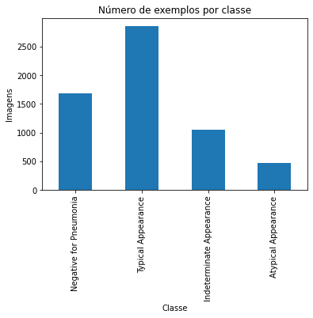
    


## Separação dos *datasets* para classificação


```python
dataset1_labels = ('Typical Appearance', 'Indeterminate Appearance')
dataset2_labels = ('Typical Appearance', 'Atypical Appearance')
dataset1 = dataset[dataset[LABEL_COL_NAME].isin(dataset1_labels)]#.sort_values(by=LABEL_COL_NAME)
dataset2 = dataset[dataset[LABEL_COL_NAME].isin(dataset2_labels)]#.sort_values(by=LABEL_COL_NAME)
```


```python
dataset1
```


<div>
<style scoped>
    .dataframe tbody tr th:only-of-type {
        vertical-align: middle;
    }

    .dataframe tbody tr th {
        vertical-align: top;
    }

    .dataframe thead th {
        text-align: right;
    }
</style>
<table border="1" class="dataframe">
  <thead>
    <tr style="text-align: right;">
      <th></th>
      <th>id</th>
      <th>Negative for Pneumonia</th>
      <th>Typical Appearance</th>
      <th>Indeterminate Appearance</th>
      <th>Atypical Appearance</th>
      <th>cat</th>
      <th>filename</th>
    </tr>
  </thead>
  <tbody>
    <tr>
      <th>0</th>
      <td>00086460a852</td>
      <td>0</td>
      <td>1</td>
      <td>0</td>
      <td>0</td>
      <td>Typical Appearance</td>
      <td>Typical Appearance/00086460a852.png</td>
    </tr>
    <tr>
      <th>7</th>
      <td>009bc005edaa</td>
      <td>0</td>
      <td>0</td>
      <td>1</td>
      <td>0</td>
      <td>Indeterminate Appearance</td>
      <td>Indeterminate Appearance/009bc005edaa.png</td>
    </tr>
    <tr>
      <th>8</th>
      <td>00a76543ed93</td>
      <td>0</td>
      <td>0</td>
      <td>1</td>
      <td>0</td>
      <td>Indeterminate Appearance</td>
      <td>Indeterminate Appearance/00a76543ed93.png</td>
    </tr>
    <tr>
      <th>9</th>
      <td>00a87235ca36</td>
      <td>0</td>
      <td>1</td>
      <td>0</td>
      <td>0</td>
      <td>Typical Appearance</td>
      <td>Typical Appearance/00a87235ca36.png</td>
    </tr>
    <tr>
      <th>10</th>
      <td>00b33b3eb8d9</td>
      <td>0</td>
      <td>1</td>
      <td>0</td>
      <td>0</td>
      <td>Typical Appearance</td>
      <td>Typical Appearance/00b33b3eb8d9.png</td>
    </tr>
    <tr>
      <th>...</th>
      <td>...</td>
      <td>...</td>
      <td>...</td>
      <td>...</td>
      <td>...</td>
      <td>...</td>
      <td>...</td>
    </tr>
    <tr>
      <th>6049</th>
      <td>ffcb4630f46f</td>
      <td>0</td>
      <td>1</td>
      <td>0</td>
      <td>0</td>
      <td>Typical Appearance</td>
      <td>Typical Appearance/ffcb4630f46f.png</td>
    </tr>
    <tr>
      <th>6050</th>
      <td>ffe4d6e8fbb0</td>
      <td>0</td>
      <td>1</td>
      <td>0</td>
      <td>0</td>
      <td>Typical Appearance</td>
      <td>Typical Appearance/ffe4d6e8fbb0.png</td>
    </tr>
    <tr>
      <th>6051</th>
      <td>ffe94fcb14fa</td>
      <td>0</td>
      <td>1</td>
      <td>0</td>
      <td>0</td>
      <td>Typical Appearance</td>
      <td>Typical Appearance/ffe94fcb14fa.png</td>
    </tr>
    <tr>
      <th>6052</th>
      <td>ffebf1ef4a9c</td>
      <td>0</td>
      <td>1</td>
      <td>0</td>
      <td>0</td>
      <td>Typical Appearance</td>
      <td>Typical Appearance/ffebf1ef4a9c.png</td>
    </tr>
    <tr>
      <th>6053</th>
      <td>fff649d65f62</td>
      <td>0</td>
      <td>1</td>
      <td>0</td>
      <td>0</td>
      <td>Typical Appearance</td>
      <td>Typical Appearance/fff649d65f62.png</td>
    </tr>
  </tbody>
</table>
<p>3904 rows × 7 columns</p>
</div>


```python
dataset2
```


<div>
<style scoped>
    .dataframe tbody tr th:only-of-type {
        vertical-align: middle;
    }

    .dataframe tbody tr th {
        vertical-align: top;
    }

    .dataframe thead th {
        text-align: right;
    }
</style>
<table border="1" class="dataframe">
  <thead>
    <tr style="text-align: right;">
      <th></th>
      <th>id</th>
      <th>Negative for Pneumonia</th>
      <th>Typical Appearance</th>
      <th>Indeterminate Appearance</th>
      <th>Atypical Appearance</th>
      <th>cat</th>
      <th>filename</th>
    </tr>
  </thead>
  <tbody>
    <tr>
      <th>0</th>
      <td>00086460a852</td>
      <td>0</td>
      <td>1</td>
      <td>0</td>
      <td>0</td>
      <td>Typical Appearance</td>
      <td>Typical Appearance/00086460a852.png</td>
    </tr>
    <tr>
      <th>1</th>
      <td>000c9c05fd14</td>
      <td>0</td>
      <td>0</td>
      <td>0</td>
      <td>1</td>
      <td>Atypical Appearance</td>
      <td>Atypical Appearance/000c9c05fd14.png</td>
    </tr>
    <tr>
      <th>4</th>
      <td>0051d9b12e72</td>
      <td>0</td>
      <td>0</td>
      <td>0</td>
      <td>1</td>
      <td>Atypical Appearance</td>
      <td>Atypical Appearance/0051d9b12e72.png</td>
    </tr>
    <tr>
      <th>9</th>
      <td>00a87235ca36</td>
      <td>0</td>
      <td>1</td>
      <td>0</td>
      <td>0</td>
      <td>Typical Appearance</td>
      <td>Typical Appearance/00a87235ca36.png</td>
    </tr>
    <tr>
      <th>10</th>
      <td>00b33b3eb8d9</td>
      <td>0</td>
      <td>1</td>
      <td>0</td>
      <td>0</td>
      <td>Typical Appearance</td>
      <td>Typical Appearance/00b33b3eb8d9.png</td>
    </tr>
    <tr>
      <th>...</th>
      <td>...</td>
      <td>...</td>
      <td>...</td>
      <td>...</td>
      <td>...</td>
      <td>...</td>
      <td>...</td>
    </tr>
    <tr>
      <th>6049</th>
      <td>ffcb4630f46f</td>
      <td>0</td>
      <td>1</td>
      <td>0</td>
      <td>0</td>
      <td>Typical Appearance</td>
      <td>Typical Appearance/ffcb4630f46f.png</td>
    </tr>
    <tr>
      <th>6050</th>
      <td>ffe4d6e8fbb0</td>
      <td>0</td>
      <td>1</td>
      <td>0</td>
      <td>0</td>
      <td>Typical Appearance</td>
      <td>Typical Appearance/ffe4d6e8fbb0.png</td>
    </tr>
    <tr>
      <th>6051</th>
      <td>ffe94fcb14fa</td>
      <td>0</td>
      <td>1</td>
      <td>0</td>
      <td>0</td>
      <td>Typical Appearance</td>
      <td>Typical Appearance/ffe94fcb14fa.png</td>
    </tr>
    <tr>
      <th>6052</th>
      <td>ffebf1ef4a9c</td>
      <td>0</td>
      <td>1</td>
      <td>0</td>
      <td>0</td>
      <td>Typical Appearance</td>
      <td>Typical Appearance/ffebf1ef4a9c.png</td>
    </tr>
    <tr>
      <th>6053</th>
      <td>fff649d65f62</td>
      <td>0</td>
      <td>1</td>
      <td>0</td>
      <td>0</td>
      <td>Typical Appearance</td>
      <td>Typical Appearance/fff649d65f62.png</td>
    </tr>
  </tbody>
</table>
<p>3329 rows × 7 columns</p>
</div>


## Convertendo imagens DICOM para PNG


```python
# Cria as pastas de cada categoria
if CREATE_DATASET:
    for cat in dataset.cat.values:
        cat_path = os.path.join(DATA_PATH, cat)
        if not os.path.exists(cat_path):
            os.makedirs(cat_path)

    with ZipFile(DICOM_PATH) as zf:
        dcm_files = [i for i in zf.infolist() if re.match('^train/.*\.dcm$', i.filename)]
        for info in tqdm(dcm_files):
            study = info.filename.split('/')[1]
            cat = dataset.loc[dataset.id == study, LABEL_COL_NAME].values[0]
            filename = f'{os.path.join(DATA_PATH, cat, study)}.{DATA_OUTPUT_FORMAT}'
            if not os.path.exists(filename):
                try:
                    ds = pydicom.dcmread(zf.open(info.filename))
                    pyplot.imsave(filename , ds.pixel_array, cmap='gray')
                except RuntimeError:
                    pass
```

## Redimensionando imagens


```python
if CREATE_DATASET:
    if not os.path.exists(DATA_PATH + '_resized'):
        os.makedirs(DATA_PATH + '_resized')
    for label in tqdm(os.listdir(DATA_PATH)):
        if not os.path.exists(os.path.join(DATA_PATH + '_resized', label)):
            os.makedirs(os.path.join(DATA_PATH + '_resized', label))
        for filename in tqdm(os.listdir(os.path.join(DATA_PATH, label))):
            if filename.endswith('.png'):
                try:
                    image = Image.open(os.path.join(DATA_PATH, label, filename))
                    image.resize(TARGET_SIZE).save(os.path.join(DATA_PATH + '_resized', label, filename), DATA_OUTPUT_FORMAT, optimize=True)
                except:
                    print(filename)
```

# Treinamento


```python
data_generator = ImageDataGenerator(rescale=1./255, shear_range=0.1, zoom_range=0.1, horizontal_flip=True)
kf = StratifiedKFold(n_splits=K_FOLDS)
```


```python
def create_model(base_model, n_classes, name):
    base_model.trainable = False

    model = Sequential([
        base_model,
        GlobalAveragePooling2D(),
        Dense(units=1024, activation='relu'),
        Dense(units=2, activation='softmax')
    ], name=name)

    return model
```


```python
def train(base_model, dataset, data_gen, model_name=''):
    fold_history = []
    fold_metrics = []
    fold_confusion_matrix = []
    
    for train_index, val_index in kf.split(dataset.index, y=dataset[LABEL_COL_NAME]):
        n_classes = dataset[LABEL_COL_NAME].nunique()
        model = create_model(base_model, n_classes, model_name)
        model.compile(optimizer=Adam(lr=LEARNING_RATE, beta_1=0.9, beta_2=0.999, amsgrad=False), loss=CategoricalCrossentropy(), metrics=['accuracy'])

        gen_params = {
            'directory': DATA_PATH + '_resized',
            'x_col': FILENAME_COL_NAME,
            'y_col': LABEL_COL_NAME,
            'class_mode': 'categorical',
            'color_mode': 'rgb',
            'target_size': TARGET_SIZE,
            'batch_size': BATCH_SIZE
        }

        train_df = dataset.iloc[train_index]
        train_gen = data_gen.flow_from_dataframe(train_df, **gen_params)
        val_df = dataset.iloc[val_index]
        val_gen = data_gen.flow_from_dataframe(val_df, **gen_params)
        classes = train_df[LABEL_COL_NAME].unique()
        class_weights = compute_class_weight('balanced', classes=classes, y=train_df[LABEL_COL_NAME])
        print(f'Class weights: {class_weights}')
        callbacks = CALLBACKS + [ModelCheckpoint(f'{model_name}.h5', monitor="val_accuracy", save_best_only=True)]
        fold_history.append(model.fit(train_gen,
                                      steps_per_epoch=train_gen.n // BATCH_SIZE,
                                      validation_data=val_gen,
                                      validation_steps=val_gen.n // BATCH_SIZE,
                                      epochs=EPOCHS,
                                      callbacks=callbacks,
                                      class_weight={i: w for i, w in enumerate(class_weights)}).history)
        
        y_true = val_gen.classes
        y_pred = model.predict(val_gen).argmax(axis=1)
        class_report = classification_report(y_true, y_pred, output_dict=True)
        conf_matrix = confusion_matrix(y_true, y_pred)
        
        fold_confusion_matrix.append(conf_matrix)
        
        metrics = {}
        if n_classes == 2:
            tp, tn, fp, fn = conf_matrix.ravel() 
            metrics = {
                'TP': tp,
                'TN': tn,
                'FP': fp,
                'FN': fn,
                'ACC': class_report['accuracy'],
                'SPE': class_report['0']['recall'],
                'REC': class_report['1']['recall'],
                'PRE': class_report['1']['precision'],
                'F1': class_report['1']['f1-score']
            }
        
        fold_metrics.append(metrics)
        
    return {
        'fold_history': fold_history,
        'fold_metrics': fold_metrics,
        'fold_confusion_matrix': fold_confusion_matrix
    }
```


```python
def plot_metrics(fold, results):
    fig, ax = pyplot.subplots(2, 2, figsize=(15, 10))
    # Obtém a lista de métricas
    metric_names = next(iter(results.items()))[1]['fold_history'][0].keys()

    for i, metric_name in enumerate(metric_names):
        row = i // 2
        col = i % 2
        if metric_name.endswith('accuracy'):
            ax[row, col].set_ylim([0, 1.0])
            ax[row, col].set_ylabel('Acurácia')
        elif metric_name.endswith(''):
            ax[row, col].set_ylabel('Erro')

        for base_model_name in BASE_MODELS:
            metric_values = results[base_model_name]['fold_history'][fold - 1][metric_name]
            ax[row, col].plot(metric_values, label=base_model_name)
        ax[row, col].set_title(f'Evolução da métrica {metric_name} do fold {fold + 1}')
        ax[row, col].set_xlim([0, 4])
        ax[row, col].set_xticks(numpy.arange(0, len(metric_values)))
        ax[row, col].set_xlabel('Época')
        ax[row, col].legend()
    pyplot.tight_layout()
```

Treina todas as combinações de modelo pré treinado e _dataset_. Salva os resultados (histórico, matriz de confusão e métricas de classificação) num dicionário indexado pelo nome do modelo pré treinado utilizado.


```python
results = []
for i, ds in enumerate([dataset1, dataset2]):
    results.append({})
    print(f'Dataset {i + 1}: {ds[LABEL_COL_NAME].unique()}')
    for base_model_name in BASE_MODELS:
        results[i][base_model_name] = train(BASE_MODELS[base_model_name], ds, data_generator, f'{base_model_name}_dataset-{i + 1}')
```

    Dataset 1: ['Typical Appearance' 'Indeterminate Appearance']


    /opt/conda/lib/python3.7/site-packages/keras_preprocessing/image/dataframe_iterator.py:282: UserWarning: Found 223 invalid image filename(s) in x_col="filename". These filename(s) will be ignored.
      .format(n_invalid, x_col)
    /opt/conda/lib/python3.7/site-packages/keras_preprocessing/image/dataframe_iterator.py:282: UserWarning: Found 69 invalid image filename(s) in x_col="filename". These filename(s) will be ignored.
      .format(n_invalid, x_col)


    Found 2900 validated image filenames belonging to 2 classes.
    Found 712 validated image filenames belonging to 2 classes.
    Class weights: [0.683669   1.86114422]
    Epoch 1/30
    90/90 [==============================] - 101s 1s/step - loss: 2.1800 - accuracy: 0.7230 - val_loss: 0.7100 - val_accuracy: 0.7173
    Epoch 2/30
    90/90 [==============================] - 97s 1s/step - loss: 0.5837 - accuracy: 0.7262 - val_loss: 0.6461 - val_accuracy: 0.7145
    Epoch 3/30
    90/90 [==============================] - 98s 1s/step - loss: 0.5908 - accuracy: 0.7197 - val_loss: 0.7377 - val_accuracy: 0.7173


    /opt/conda/lib/python3.7/site-packages/sklearn/metrics/_classification.py:1221: UndefinedMetricWarning: Precision and F-score are ill-defined and being set to 0.0 in labels with no predicted samples. Use `zero_division` parameter to control this behavior.
      _warn_prf(average, modifier, msg_start, len(result))
    /opt/conda/lib/python3.7/site-packages/keras_preprocessing/image/dataframe_iterator.py:282: UserWarning: Found 244 invalid image filename(s) in x_col="filename". These filename(s) will be ignored.
      .format(n_invalid, x_col)
    /opt/conda/lib/python3.7/site-packages/keras_preprocessing/image/dataframe_iterator.py:282: UserWarning: Found 48 invalid image filename(s) in x_col="filename". These filename(s) will be ignored.
      .format(n_invalid, x_col)


    Found 2879 validated image filenames belonging to 2 classes.
    Found 733 validated image filenames belonging to 2 classes.
    Class weights: [0.683669   1.86114422]
    Epoch 1/30
    89/89 [==============================] - 100s 1s/step - loss: 3.2404 - accuracy: 0.6734 - val_loss: 0.8870 - val_accuracy: 0.7273
    Epoch 2/30
    89/89 [==============================] - 97s 1s/step - loss: 0.5896 - accuracy: 0.7227 - val_loss: 0.6896 - val_accuracy: 0.7259
    Epoch 3/30
    89/89 [==============================] - 97s 1s/step - loss: 0.5824 - accuracy: 0.7251 - val_loss: 0.6587 - val_accuracy: 0.7216


    /opt/conda/lib/python3.7/site-packages/keras_preprocessing/image/dataframe_iterator.py:282: UserWarning: Found 231 invalid image filename(s) in x_col="filename". These filename(s) will be ignored.
      .format(n_invalid, x_col)
    /opt/conda/lib/python3.7/site-packages/keras_preprocessing/image/dataframe_iterator.py:282: UserWarning: Found 61 invalid image filename(s) in x_col="filename". These filename(s) will be ignored.
      .format(n_invalid, x_col)


    Found 2892 validated image filenames belonging to 2 classes.
    Found 720 validated image filenames belonging to 2 classes.
    Class weights: [0.683669   1.86114422]
    Epoch 1/30
    90/90 [==============================] - 101s 1s/step - loss: 3.6595 - accuracy: 0.6546 - val_loss: 0.6259 - val_accuracy: 0.7301
    Epoch 2/30
    90/90 [==============================] - 97s 1s/step - loss: 0.5833 - accuracy: 0.7218 - val_loss: 0.6786 - val_accuracy: 0.7259
    Epoch 3/30
    90/90 [==============================] - 97s 1s/step - loss: 0.5819 - accuracy: 0.7184 - val_loss: 0.7345 - val_accuracy: 0.7287


    /opt/conda/lib/python3.7/site-packages/keras_preprocessing/image/dataframe_iterator.py:282: UserWarning: Found 234 invalid image filename(s) in x_col="filename". These filename(s) will be ignored.
      .format(n_invalid, x_col)
    /opt/conda/lib/python3.7/site-packages/keras_preprocessing/image/dataframe_iterator.py:282: UserWarning: Found 58 invalid image filename(s) in x_col="filename". These filename(s) will be ignored.
      .format(n_invalid, x_col)


    Found 2889 validated image filenames belonging to 2 classes.
    Found 723 validated image filenames belonging to 2 classes.
    Class weights: [0.683669   1.86114422]
    Epoch 1/30
    90/90 [==============================] - 100s 1s/step - loss: 1.9553 - accuracy: 0.6713 - val_loss: 0.7583 - val_accuracy: 0.7273
    Epoch 2/30
    90/90 [==============================] - 97s 1s/step - loss: 0.5803 - accuracy: 0.7344 - val_loss: 0.6923 - val_accuracy: 0.7259
    Epoch 3/30
    90/90 [==============================] - 97s 1s/step - loss: 0.5721 - accuracy: 0.7303 - val_loss: 0.6965 - val_accuracy: 0.7287
    Epoch 4/30
    90/90 [==============================] - 97s 1s/step - loss: 0.5775 - accuracy: 0.7276 - val_loss: 0.6686 - val_accuracy: 0.7330
    Epoch 5/30
    90/90 [==============================] - 97s 1s/step - loss: 0.5816 - accuracy: 0.7265 - val_loss: 0.6410 - val_accuracy: 0.7259
    Epoch 6/30
    90/90 [==============================] - 97s 1s/step - loss: 0.5753 - accuracy: 0.7265 - val_loss: 0.6608 - val_accuracy: 0.7259


    /opt/conda/lib/python3.7/site-packages/keras_preprocessing/image/dataframe_iterator.py:282: UserWarning: Found 236 invalid image filename(s) in x_col="filename". These filename(s) will be ignored.
      .format(n_invalid, x_col)
    /opt/conda/lib/python3.7/site-packages/keras_preprocessing/image/dataframe_iterator.py:282: UserWarning: Found 56 invalid image filename(s) in x_col="filename". These filename(s) will be ignored.
      .format(n_invalid, x_col)


    Found 2888 validated image filenames belonging to 2 classes.
    Found 724 validated image filenames belonging to 2 classes.
    Class weights: [0.68388792 1.85952381]
    Epoch 1/30
    90/90 [==============================] - 101s 1s/step - loss: 2.3696 - accuracy: 0.6942 - val_loss: 1.0455 - val_accuracy: 0.7287
    Epoch 2/30
    90/90 [==============================] - 97s 1s/step - loss: 0.6333 - accuracy: 0.7124 - val_loss: 0.6672 - val_accuracy: 0.7330
    Epoch 3/30
    90/90 [==============================] - 97s 1s/step - loss: 0.5953 - accuracy: 0.7216 - val_loss: 0.7030 - val_accuracy: 0.7372
    Epoch 4/30
    90/90 [==============================] - 97s 1s/step - loss: 0.5829 - accuracy: 0.7234 - val_loss: 0.6228 - val_accuracy: 0.7344
    Epoch 5/30
    90/90 [==============================] - 97s 1s/step - loss: 0.5756 - accuracy: 0.7242 - val_loss: 0.6434 - val_accuracy: 0.7330


    /opt/conda/lib/python3.7/site-packages/keras_preprocessing/image/dataframe_iterator.py:282: UserWarning: Found 223 invalid image filename(s) in x_col="filename". These filename(s) will be ignored.
      .format(n_invalid, x_col)
    /opt/conda/lib/python3.7/site-packages/keras_preprocessing/image/dataframe_iterator.py:282: UserWarning: Found 69 invalid image filename(s) in x_col="filename". These filename(s) will be ignored.
      .format(n_invalid, x_col)


    Found 2900 validated image filenames belonging to 2 classes.
    Found 712 validated image filenames belonging to 2 classes.
    Class weights: [0.683669   1.86114422]
    Epoch 1/30
    90/90 [==============================] - 72s 769ms/step - loss: 19.0128 - accuracy: 0.6565 - val_loss: 1.5675 - val_accuracy: 0.7202
    Epoch 2/30
    90/90 [==============================] - 68s 754ms/step - loss: 1.0602 - accuracy: 0.7089 - val_loss: 1.4630 - val_accuracy: 0.7188
    Epoch 3/30
    90/90 [==============================] - 68s 753ms/step - loss: 0.8108 - accuracy: 0.7310 - val_loss: 0.6120 - val_accuracy: 0.7216
    Epoch 4/30
    90/90 [==============================] - 68s 753ms/step - loss: 0.6749 - accuracy: 0.7084 - val_loss: 0.8665 - val_accuracy: 0.7173
    Epoch 5/30
    90/90 [==============================] - 68s 754ms/step - loss: 0.5702 - accuracy: 0.7210 - val_loss: 0.9959 - val_accuracy: 0.7173


    /opt/conda/lib/python3.7/site-packages/keras_preprocessing/image/dataframe_iterator.py:282: UserWarning: Found 244 invalid image filename(s) in x_col="filename". These filename(s) will be ignored.
      .format(n_invalid, x_col)
    /opt/conda/lib/python3.7/site-packages/keras_preprocessing/image/dataframe_iterator.py:282: UserWarning: Found 48 invalid image filename(s) in x_col="filename". These filename(s) will be ignored.
      .format(n_invalid, x_col)


    Found 2879 validated image filenames belonging to 2 classes.
    Found 733 validated image filenames belonging to 2 classes.
    Class weights: [0.683669   1.86114422]
    Epoch 1/30
    89/89 [==============================] - 73s 773ms/step - loss: 9.2104 - accuracy: 0.6682 - val_loss: 0.6234 - val_accuracy: 0.7230
    Epoch 2/30
    89/89 [==============================] - 68s 759ms/step - loss: 0.6176 - accuracy: 0.7307 - val_loss: 0.5882 - val_accuracy: 0.7301
    Epoch 3/30
    89/89 [==============================] - 67s 758ms/step - loss: 0.5511 - accuracy: 0.7209 - val_loss: 0.6687 - val_accuracy: 0.7273
    Epoch 4/30
    89/89 [==============================] - 68s 759ms/step - loss: 0.5555 - accuracy: 0.7201 - val_loss: 0.5741 - val_accuracy: 0.7202


    /opt/conda/lib/python3.7/site-packages/sklearn/metrics/_classification.py:1221: UndefinedMetricWarning: Precision and F-score are ill-defined and being set to 0.0 in labels with no predicted samples. Use `zero_division` parameter to control this behavior.
      _warn_prf(average, modifier, msg_start, len(result))
    /opt/conda/lib/python3.7/site-packages/keras_preprocessing/image/dataframe_iterator.py:282: UserWarning: Found 231 invalid image filename(s) in x_col="filename". These filename(s) will be ignored.
      .format(n_invalid, x_col)
    /opt/conda/lib/python3.7/site-packages/keras_preprocessing/image/dataframe_iterator.py:282: UserWarning: Found 61 invalid image filename(s) in x_col="filename". These filename(s) will be ignored.
      .format(n_invalid, x_col)


    Found 2892 validated image filenames belonging to 2 classes.
    Found 720 validated image filenames belonging to 2 classes.
    Class weights: [0.683669   1.86114422]
    Epoch 1/30
    90/90 [==============================] - 72s 769ms/step - loss: 11.2669 - accuracy: 0.6719 - val_loss: 2.3801 - val_accuracy: 0.7259
    Epoch 2/30
    90/90 [==============================] - 68s 754ms/step - loss: 0.8483 - accuracy: 0.7197 - val_loss: 1.3688 - val_accuracy: 0.7315
    Epoch 3/30
    90/90 [==============================] - 68s 753ms/step - loss: 0.5985 - accuracy: 0.7256 - val_loss: 0.5643 - val_accuracy: 0.7273
    Epoch 4/30
    90/90 [==============================] - 68s 754ms/step - loss: 0.5625 - accuracy: 0.7162 - val_loss: 0.7146 - val_accuracy: 0.7330
    Epoch 5/30
    90/90 [==============================] - 68s 752ms/step - loss: 0.5341 - accuracy: 0.7237 - val_loss: 0.6161 - val_accuracy: 0.7273
    Epoch 6/30
    90/90 [==============================] - 68s 752ms/step - loss: 0.5301 - accuracy: 0.7390 - val_loss: 0.7502 - val_accuracy: 0.7273


    /opt/conda/lib/python3.7/site-packages/keras_preprocessing/image/dataframe_iterator.py:282: UserWarning: Found 234 invalid image filename(s) in x_col="filename". These filename(s) will be ignored.
      .format(n_invalid, x_col)
    /opt/conda/lib/python3.7/site-packages/keras_preprocessing/image/dataframe_iterator.py:282: UserWarning: Found 58 invalid image filename(s) in x_col="filename". These filename(s) will be ignored.
      .format(n_invalid, x_col)


    Found 2889 validated image filenames belonging to 2 classes.
    Found 723 validated image filenames belonging to 2 classes.
    Class weights: [0.683669   1.86114422]
    Epoch 1/30
    90/90 [==============================] - 73s 768ms/step - loss: 12.2756 - accuracy: 0.6658 - val_loss: 0.5873 - val_accuracy: 0.7031
    Epoch 2/30
    90/90 [==============================] - 68s 753ms/step - loss: 0.6061 - accuracy: 0.7271 - val_loss: 0.5826 - val_accuracy: 0.7244
    Epoch 3/30
    90/90 [==============================] - 68s 752ms/step - loss: 0.5325 - accuracy: 0.7432 - val_loss: 0.6999 - val_accuracy: 0.7301
    Epoch 4/30
    90/90 [==============================] - 68s 757ms/step - loss: 0.5407 - accuracy: 0.7288 - val_loss: 0.6668 - val_accuracy: 0.7259
    Epoch 5/30
    90/90 [==============================] - 68s 752ms/step - loss: 0.5411 - accuracy: 0.7265 - val_loss: 0.6528 - val_accuracy: 0.7301


    /opt/conda/lib/python3.7/site-packages/keras_preprocessing/image/dataframe_iterator.py:282: UserWarning: Found 236 invalid image filename(s) in x_col="filename". These filename(s) will be ignored.
      .format(n_invalid, x_col)
    /opt/conda/lib/python3.7/site-packages/keras_preprocessing/image/dataframe_iterator.py:282: UserWarning: Found 56 invalid image filename(s) in x_col="filename". These filename(s) will be ignored.
      .format(n_invalid, x_col)


    Found 2888 validated image filenames belonging to 2 classes.
    Found 724 validated image filenames belonging to 2 classes.
    Class weights: [0.68388792 1.85952381]
    Epoch 1/30
    90/90 [==============================] - 73s 776ms/step - loss: 15.1754 - accuracy: 0.6675 - val_loss: 0.6602 - val_accuracy: 0.7330
    Epoch 2/30
    90/90 [==============================] - 68s 753ms/step - loss: 0.7490 - accuracy: 0.7046 - val_loss: 0.8400 - val_accuracy: 0.7358
    Epoch 3/30
    90/90 [==============================] - 68s 752ms/step - loss: 0.5947 - accuracy: 0.7316 - val_loss: 0.7978 - val_accuracy: 0.7358
    Epoch 4/30
    90/90 [==============================] - 68s 751ms/step - loss: 0.5624 - accuracy: 0.7297 - val_loss: 0.5688 - val_accuracy: 0.7259


    /opt/conda/lib/python3.7/site-packages/keras_preprocessing/image/dataframe_iterator.py:282: UserWarning: Found 223 invalid image filename(s) in x_col="filename". These filename(s) will be ignored.
      .format(n_invalid, x_col)
    /opt/conda/lib/python3.7/site-packages/keras_preprocessing/image/dataframe_iterator.py:282: UserWarning: Found 69 invalid image filename(s) in x_col="filename". These filename(s) will be ignored.
      .format(n_invalid, x_col)


    Found 2900 validated image filenames belonging to 2 classes.
    Found 712 validated image filenames belonging to 2 classes.
    Class weights: [0.683669   1.86114422]
    Epoch 1/30
    90/90 [==============================] - 168s 2s/step - loss: 2.2063 - accuracy: 0.6689 - val_loss: 0.6525 - val_accuracy: 0.7173
    Epoch 2/30
    90/90 [==============================] - 163s 2s/step - loss: 0.5821 - accuracy: 0.7272 - val_loss: 0.8603 - val_accuracy: 0.7202
    Epoch 3/30
    90/90 [==============================] - 163s 2s/step - loss: 0.5657 - accuracy: 0.7331 - val_loss: 0.8287 - val_accuracy: 0.7188
    Epoch 4/30
    90/90 [==============================] - 162s 2s/step - loss: 0.5896 - accuracy: 0.7269 - val_loss: 0.8628 - val_accuracy: 0.7188


    /opt/conda/lib/python3.7/site-packages/sklearn/metrics/_classification.py:1221: UndefinedMetricWarning: Precision and F-score are ill-defined and being set to 0.0 in labels with no predicted samples. Use `zero_division` parameter to control this behavior.
      _warn_prf(average, modifier, msg_start, len(result))
    /opt/conda/lib/python3.7/site-packages/keras_preprocessing/image/dataframe_iterator.py:282: UserWarning: Found 244 invalid image filename(s) in x_col="filename". These filename(s) will be ignored.
      .format(n_invalid, x_col)
    /opt/conda/lib/python3.7/site-packages/keras_preprocessing/image/dataframe_iterator.py:282: UserWarning: Found 48 invalid image filename(s) in x_col="filename". These filename(s) will be ignored.
      .format(n_invalid, x_col)


    Found 2879 validated image filenames belonging to 2 classes.
    Found 733 validated image filenames belonging to 2 classes.
    Class weights: [0.683669   1.86114422]
    Epoch 1/30
    89/89 [==============================] - 168s 2s/step - loss: 2.2861 - accuracy: 0.6988 - val_loss: 0.6732 - val_accuracy: 0.7216
    Epoch 2/30
    89/89 [==============================] - 162s 2s/step - loss: 0.5881 - accuracy: 0.7168 - val_loss: 0.8304 - val_accuracy: 0.7301
    Epoch 3/30
    89/89 [==============================] - 163s 2s/step - loss: 0.5944 - accuracy: 0.7253 - val_loss: 0.7083 - val_accuracy: 0.7273
    Epoch 4/30
    89/89 [==============================] - 162s 2s/step - loss: 0.5714 - accuracy: 0.7297 - val_loss: 0.6730 - val_accuracy: 0.7259


    /opt/conda/lib/python3.7/site-packages/keras_preprocessing/image/dataframe_iterator.py:282: UserWarning: Found 231 invalid image filename(s) in x_col="filename". These filename(s) will be ignored.
      .format(n_invalid, x_col)
    /opt/conda/lib/python3.7/site-packages/keras_preprocessing/image/dataframe_iterator.py:282: UserWarning: Found 61 invalid image filename(s) in x_col="filename". These filename(s) will be ignored.
      .format(n_invalid, x_col)


    Found 2892 validated image filenames belonging to 2 classes.
    Found 720 validated image filenames belonging to 2 classes.
    Class weights: [0.683669   1.86114422]
    Epoch 1/30
    90/90 [==============================] - 170s 2s/step - loss: 1.6596 - accuracy: 0.7010 - val_loss: 0.6985 - val_accuracy: 0.7287
    Epoch 2/30
    90/90 [==============================] - 166s 2s/step - loss: 0.6012 - accuracy: 0.7141 - val_loss: 0.6812 - val_accuracy: 0.7244
    Epoch 3/30
    90/90 [==============================] - 166s 2s/step - loss: 0.5870 - accuracy: 0.7310 - val_loss: 0.6455 - val_accuracy: 0.7330
    Epoch 4/30
    90/90 [==============================] - 166s 2s/step - loss: 0.5731 - accuracy: 0.7226 - val_loss: 0.6842 - val_accuracy: 0.7259
    Epoch 5/30
    90/90 [==============================] - 164s 2s/step - loss: 0.5754 - accuracy: 0.7263 - val_loss: 0.6028 - val_accuracy: 0.7287


    /opt/conda/lib/python3.7/site-packages/keras_preprocessing/image/dataframe_iterator.py:282: UserWarning: Found 234 invalid image filename(s) in x_col="filename". These filename(s) will be ignored.
      .format(n_invalid, x_col)
    /opt/conda/lib/python3.7/site-packages/keras_preprocessing/image/dataframe_iterator.py:282: UserWarning: Found 58 invalid image filename(s) in x_col="filename". These filename(s) will be ignored.
      .format(n_invalid, x_col)


    Found 2889 validated image filenames belonging to 2 classes.
    Found 723 validated image filenames belonging to 2 classes.
    Class weights: [0.683669   1.86114422]
    Epoch 1/30
    90/90 [==============================] - 170s 2s/step - loss: 1.4725 - accuracy: 0.7106 - val_loss: 0.6061 - val_accuracy: 0.7330
    Epoch 2/30
    90/90 [==============================] - 162s 2s/step - loss: 0.6015 - accuracy: 0.7200 - val_loss: 0.6517 - val_accuracy: 0.7259
    Epoch 3/30
    90/90 [==============================] - 162s 2s/step - loss: 0.5830 - accuracy: 0.7289 - val_loss: 0.6506 - val_accuracy: 0.7230


    /opt/conda/lib/python3.7/site-packages/keras_preprocessing/image/dataframe_iterator.py:282: UserWarning: Found 236 invalid image filename(s) in x_col="filename". These filename(s) will be ignored.
      .format(n_invalid, x_col)
    /opt/conda/lib/python3.7/site-packages/keras_preprocessing/image/dataframe_iterator.py:282: UserWarning: Found 56 invalid image filename(s) in x_col="filename". These filename(s) will be ignored.
      .format(n_invalid, x_col)


    Found 2888 validated image filenames belonging to 2 classes.
    Found 724 validated image filenames belonging to 2 classes.
    Class weights: [0.68388792 1.85952381]
    Epoch 1/30
    90/90 [==============================] - 168s 2s/step - loss: 1.1989 - accuracy: 0.7109 - val_loss: 0.5967 - val_accuracy: 0.7344
    Epoch 2/30
    90/90 [==============================] - 162s 2s/step - loss: 0.5865 - accuracy: 0.7239 - val_loss: 0.6717 - val_accuracy: 0.7287
    Epoch 3/30
    90/90 [==============================] - 162s 2s/step - loss: 0.5678 - accuracy: 0.7307 - val_loss: 0.7058 - val_accuracy: 0.7315


    /opt/conda/lib/python3.7/site-packages/keras_preprocessing/image/dataframe_iterator.py:282: UserWarning: Found 223 invalid image filename(s) in x_col="filename". These filename(s) will be ignored.
      .format(n_invalid, x_col)
    /opt/conda/lib/python3.7/site-packages/keras_preprocessing/image/dataframe_iterator.py:282: UserWarning: Found 69 invalid image filename(s) in x_col="filename". These filename(s) will be ignored.
      .format(n_invalid, x_col)


    Found 2900 validated image filenames belonging to 2 classes.
    Found 712 validated image filenames belonging to 2 classes.
    Class weights: [0.683669   1.86114422]
    Epoch 1/30
    90/90 [==============================] - 136s 1s/step - loss: 13.2878 - accuracy: 0.6541 - val_loss: 0.5983 - val_accuracy: 0.7202
    Epoch 2/30
    90/90 [==============================] - 126s 1s/step - loss: 0.6220 - accuracy: 0.7399 - val_loss: 1.2418 - val_accuracy: 0.7202
    Epoch 3/30
    90/90 [==============================] - 125s 1s/step - loss: 0.6575 - accuracy: 0.7159 - val_loss: 0.6336 - val_accuracy: 0.7145


    /opt/conda/lib/python3.7/site-packages/keras_preprocessing/image/dataframe_iterator.py:282: UserWarning: Found 244 invalid image filename(s) in x_col="filename". These filename(s) will be ignored.
      .format(n_invalid, x_col)
    /opt/conda/lib/python3.7/site-packages/keras_preprocessing/image/dataframe_iterator.py:282: UserWarning: Found 48 invalid image filename(s) in x_col="filename". These filename(s) will be ignored.
      .format(n_invalid, x_col)


    Found 2879 validated image filenames belonging to 2 classes.
    Found 733 validated image filenames belonging to 2 classes.
    Class weights: [0.683669   1.86114422]
    Epoch 1/30
    89/89 [==============================] - 136s 1s/step - loss: 19.1314 - accuracy: 0.6697 - val_loss: 0.9260 - val_accuracy: 0.7259
    Epoch 2/30
    89/89 [==============================] - 125s 1s/step - loss: 0.7186 - accuracy: 0.7086 - val_loss: 0.7854 - val_accuracy: 0.7230
    Epoch 3/30
    89/89 [==============================] - 125s 1s/step - loss: 0.6499 - accuracy: 0.7202 - val_loss: 0.8646 - val_accuracy: 0.7230


    /opt/conda/lib/python3.7/site-packages/keras_preprocessing/image/dataframe_iterator.py:282: UserWarning: Found 231 invalid image filename(s) in x_col="filename". These filename(s) will be ignored.
      .format(n_invalid, x_col)
    /opt/conda/lib/python3.7/site-packages/keras_preprocessing/image/dataframe_iterator.py:282: UserWarning: Found 61 invalid image filename(s) in x_col="filename". These filename(s) will be ignored.
      .format(n_invalid, x_col)


    Found 2892 validated image filenames belonging to 2 classes.
    Found 720 validated image filenames belonging to 2 classes.
    Class weights: [0.683669   1.86114422]
    Epoch 1/30
    90/90 [==============================] - 137s 1s/step - loss: 12.4216 - accuracy: 0.6570 - val_loss: 4.6122 - val_accuracy: 0.7287
    Epoch 2/30
    90/90 [==============================] - 125s 1s/step - loss: 1.3605 - accuracy: 0.6988 - val_loss: 0.8343 - val_accuracy: 0.7259
    Epoch 3/30
    90/90 [==============================] - 125s 1s/step - loss: 0.6264 - accuracy: 0.7259 - val_loss: 0.5879 - val_accuracy: 0.7315
    Epoch 4/30
    90/90 [==============================] - 126s 1s/step - loss: 0.5522 - accuracy: 0.7325 - val_loss: 0.5620 - val_accuracy: 0.7202
    Epoch 5/30
    90/90 [==============================] - 125s 1s/step - loss: 0.5786 - accuracy: 0.7249 - val_loss: 0.5927 - val_accuracy: 0.7244


    /opt/conda/lib/python3.7/site-packages/keras_preprocessing/image/dataframe_iterator.py:282: UserWarning: Found 234 invalid image filename(s) in x_col="filename". These filename(s) will be ignored.
      .format(n_invalid, x_col)
    /opt/conda/lib/python3.7/site-packages/keras_preprocessing/image/dataframe_iterator.py:282: UserWarning: Found 58 invalid image filename(s) in x_col="filename". These filename(s) will be ignored.
      .format(n_invalid, x_col)


    Found 2889 validated image filenames belonging to 2 classes.
    Found 723 validated image filenames belonging to 2 classes.
    Class weights: [0.683669   1.86114422]
    Epoch 1/30
    90/90 [==============================] - 136s 1s/step - loss: 15.6975 - accuracy: 0.6662 - val_loss: 0.6817 - val_accuracy: 0.7244
    Epoch 2/30
    90/90 [==============================] - 126s 1s/step - loss: 0.8269 - accuracy: 0.7102 - val_loss: 1.5029 - val_accuracy: 0.7259
    Epoch 3/30
    90/90 [==============================] - 125s 1s/step - loss: 0.7713 - accuracy: 0.7168 - val_loss: 0.9491 - val_accuracy: 0.7330
    Epoch 4/30
    90/90 [==============================] - 125s 1s/step - loss: 0.5792 - accuracy: 0.7333 - val_loss: 1.0288 - val_accuracy: 0.7273
    Epoch 5/30
    90/90 [==============================] - 125s 1s/step - loss: 0.5514 - accuracy: 0.7508 - val_loss: 0.7557 - val_accuracy: 0.7259


    /opt/conda/lib/python3.7/site-packages/sklearn/metrics/_classification.py:1221: UndefinedMetricWarning: Precision and F-score are ill-defined and being set to 0.0 in labels with no predicted samples. Use `zero_division` parameter to control this behavior.
      _warn_prf(average, modifier, msg_start, len(result))
    /opt/conda/lib/python3.7/site-packages/keras_preprocessing/image/dataframe_iterator.py:282: UserWarning: Found 236 invalid image filename(s) in x_col="filename". These filename(s) will be ignored.
      .format(n_invalid, x_col)
    /opt/conda/lib/python3.7/site-packages/keras_preprocessing/image/dataframe_iterator.py:282: UserWarning: Found 56 invalid image filename(s) in x_col="filename". These filename(s) will be ignored.
      .format(n_invalid, x_col)


    Found 2888 validated image filenames belonging to 2 classes.
    Found 724 validated image filenames belonging to 2 classes.
    Class weights: [0.68388792 1.85952381]
    Epoch 1/30
    90/90 [==============================] - 135s 1s/step - loss: 15.4833 - accuracy: 0.6599 - val_loss: 0.8375 - val_accuracy: 0.5412
    Epoch 2/30
    90/90 [==============================] - 126s 1s/step - loss: 0.7561 - accuracy: 0.6935 - val_loss: 0.6380 - val_accuracy: 0.7330
    Epoch 3/30
    90/90 [==============================] - 125s 1s/step - loss: 0.5877 - accuracy: 0.7525 - val_loss: 0.8271 - val_accuracy: 0.7315
    Epoch 4/30
    90/90 [==============================] - 125s 1s/step - loss: 0.5488 - accuracy: 0.7385 - val_loss: 0.7101 - val_accuracy: 0.7358
    Epoch 5/30
    90/90 [==============================] - 125s 1s/step - loss: 0.6149 - accuracy: 0.7174 - val_loss: 0.6428 - val_accuracy: 0.7315
    Epoch 6/30
    90/90 [==============================] - 125s 1s/step - loss: 0.5407 - accuracy: 0.7303 - val_loss: 0.7143 - val_accuracy: 0.7330


    /opt/conda/lib/python3.7/site-packages/keras_preprocessing/image/dataframe_iterator.py:282: UserWarning: Found 223 invalid image filename(s) in x_col="filename". These filename(s) will be ignored.
      .format(n_invalid, x_col)
    /opt/conda/lib/python3.7/site-packages/keras_preprocessing/image/dataframe_iterator.py:282: UserWarning: Found 69 invalid image filename(s) in x_col="filename". These filename(s) will be ignored.
      .format(n_invalid, x_col)


    Found 2900 validated image filenames belonging to 2 classes.
    Found 712 validated image filenames belonging to 2 classes.
    Class weights: [0.683669   1.86114422]
    Epoch 1/30
    90/90 [==============================] - 242s 3s/step - loss: 1.6316 - accuracy: 0.7058 - val_loss: 0.6282 - val_accuracy: 0.7173
    Epoch 2/30
    90/90 [==============================] - 232s 3s/step - loss: 0.5831 - accuracy: 0.7203 - val_loss: 0.7232 - val_accuracy: 0.7173
    Epoch 3/30
    90/90 [==============================] - 232s 3s/step - loss: 0.5858 - accuracy: 0.7221 - val_loss: 0.7038 - val_accuracy: 0.7202
    Epoch 4/30
    90/90 [==============================] - 232s 3s/step - loss: 0.5658 - accuracy: 0.7385 - val_loss: 0.6674 - val_accuracy: 0.7173
    Epoch 5/30
    90/90 [==============================] - 232s 3s/step - loss: 0.5719 - accuracy: 0.7314 - val_loss: 0.6987 - val_accuracy: 0.7159


    /opt/conda/lib/python3.7/site-packages/sklearn/metrics/_classification.py:1221: UndefinedMetricWarning: Precision and F-score are ill-defined and being set to 0.0 in labels with no predicted samples. Use `zero_division` parameter to control this behavior.
      _warn_prf(average, modifier, msg_start, len(result))
    /opt/conda/lib/python3.7/site-packages/keras_preprocessing/image/dataframe_iterator.py:282: UserWarning: Found 244 invalid image filename(s) in x_col="filename". These filename(s) will be ignored.
      .format(n_invalid, x_col)
    /opt/conda/lib/python3.7/site-packages/keras_preprocessing/image/dataframe_iterator.py:282: UserWarning: Found 48 invalid image filename(s) in x_col="filename". These filename(s) will be ignored.
      .format(n_invalid, x_col)


    Found 2879 validated image filenames belonging to 2 classes.
    Found 733 validated image filenames belonging to 2 classes.
    Class weights: [0.683669   1.86114422]
    Epoch 1/30
    89/89 [==============================] - 241s 3s/step - loss: 1.7504 - accuracy: 0.6964 - val_loss: 0.6056 - val_accuracy: 0.7301
    Epoch 2/30
    89/89 [==============================] - 231s 3s/step - loss: 0.5674 - accuracy: 0.7413 - val_loss: 0.6638 - val_accuracy: 0.7287
    Epoch 3/30
    89/89 [==============================] - 230s 3s/step - loss: 0.5773 - accuracy: 0.7297 - val_loss: 0.7282 - val_accuracy: 0.7259


    /opt/conda/lib/python3.7/site-packages/keras_preprocessing/image/dataframe_iterator.py:282: UserWarning: Found 231 invalid image filename(s) in x_col="filename". These filename(s) will be ignored.
      .format(n_invalid, x_col)
    /opt/conda/lib/python3.7/site-packages/keras_preprocessing/image/dataframe_iterator.py:282: UserWarning: Found 61 invalid image filename(s) in x_col="filename". These filename(s) will be ignored.
      .format(n_invalid, x_col)


    Found 2892 validated image filenames belonging to 2 classes.
    Found 720 validated image filenames belonging to 2 classes.
    Class weights: [0.683669   1.86114422]
    Epoch 1/30
    90/90 [==============================] - 242s 3s/step - loss: 2.0790 - accuracy: 0.6889 - val_loss: 0.6600 - val_accuracy: 0.7287
    Epoch 2/30
    90/90 [==============================] - 232s 3s/step - loss: 0.5723 - accuracy: 0.7356 - val_loss: 0.6366 - val_accuracy: 0.7301
    Epoch 3/30
    90/90 [==============================] - 232s 3s/step - loss: 0.5978 - accuracy: 0.7217 - val_loss: 0.6447 - val_accuracy: 0.7287
    Epoch 4/30
    90/90 [==============================] - 232s 3s/step - loss: 0.5892 - accuracy: 0.7177 - val_loss: 0.8102 - val_accuracy: 0.7287


    /opt/conda/lib/python3.7/site-packages/keras_preprocessing/image/dataframe_iterator.py:282: UserWarning: Found 234 invalid image filename(s) in x_col="filename". These filename(s) will be ignored.
      .format(n_invalid, x_col)
    /opt/conda/lib/python3.7/site-packages/keras_preprocessing/image/dataframe_iterator.py:282: UserWarning: Found 58 invalid image filename(s) in x_col="filename". These filename(s) will be ignored.
      .format(n_invalid, x_col)


    Found 2889 validated image filenames belonging to 2 classes.
    Found 723 validated image filenames belonging to 2 classes.
    Class weights: [0.683669   1.86114422]
    Epoch 1/30
    90/90 [==============================] - 241s 3s/step - loss: 2.1164 - accuracy: 0.7108 - val_loss: 0.6700 - val_accuracy: 0.7244
    Epoch 2/30
    90/90 [==============================] - 232s 3s/step - loss: 0.5980 - accuracy: 0.7273 - val_loss: 0.6352 - val_accuracy: 0.7273
    Epoch 3/30
    90/90 [==============================] - 232s 3s/step - loss: 0.5898 - accuracy: 0.7290 - val_loss: 0.7385 - val_accuracy: 0.7244
    Epoch 4/30
    90/90 [==============================] - 232s 3s/step - loss: 0.6085 - accuracy: 0.7103 - val_loss: 0.6181 - val_accuracy: 0.7244


    /opt/conda/lib/python3.7/site-packages/keras_preprocessing/image/dataframe_iterator.py:282: UserWarning: Found 236 invalid image filename(s) in x_col="filename". These filename(s) will be ignored.
      .format(n_invalid, x_col)
    /opt/conda/lib/python3.7/site-packages/keras_preprocessing/image/dataframe_iterator.py:282: UserWarning: Found 56 invalid image filename(s) in x_col="filename". These filename(s) will be ignored.
      .format(n_invalid, x_col)


    Found 2888 validated image filenames belonging to 2 classes.
    Found 724 validated image filenames belonging to 2 classes.
    Class weights: [0.68388792 1.85952381]
    Epoch 1/30
    90/90 [==============================] - 241s 3s/step - loss: 1.9480 - accuracy: 0.6740 - val_loss: 0.5855 - val_accuracy: 0.7344
    Epoch 2/30
    90/90 [==============================] - 232s 3s/step - loss: 0.5918 - accuracy: 0.7334 - val_loss: 0.6338 - val_accuracy: 0.7259
    Epoch 3/30
    90/90 [==============================] - 233s 3s/step - loss: 0.5789 - accuracy: 0.7275 - val_loss: 0.5984 - val_accuracy: 0.7415
    Epoch 4/30
    90/90 [==============================] - 235s 3s/step - loss: 0.5740 - accuracy: 0.7310 - val_loss: 0.6607 - val_accuracy: 0.7358
    Epoch 5/30
    90/90 [==============================] - 231s 3s/step - loss: 0.5733 - accuracy: 0.7260 - val_loss: 0.6077 - val_accuracy: 0.7344
    Dataset 2: ['Typical Appearance' 'Atypical Appearance']


    /opt/conda/lib/python3.7/site-packages/keras_preprocessing/image/dataframe_iterator.py:282: UserWarning: Found 183 invalid image filename(s) in x_col="filename". These filename(s) will be ignored.
      .format(n_invalid, x_col)
    /opt/conda/lib/python3.7/site-packages/keras_preprocessing/image/dataframe_iterator.py:282: UserWarning: Found 64 invalid image filename(s) in x_col="filename". These filename(s) will be ignored.
      .format(n_invalid, x_col)


    Found 2480 validated image filenames belonging to 2 classes.
    Found 602 validated image filenames belonging to 2 classes.
    Class weights: [3.51319261 0.58296848]
    Epoch 1/30
    77/77 [==============================] - 86s 1s/step - loss: 2.1049 - accuracy: 0.4112 - val_loss: 0.7086 - val_accuracy: 0.1510
    Epoch 2/30
    77/77 [==============================] - 83s 1s/step - loss: 0.7216 - accuracy: 0.2022 - val_loss: 0.6666 - val_accuracy: 0.8542
    Epoch 3/30
    77/77 [==============================] - 83s 1s/step - loss: 0.7145 - accuracy: 0.6994 - val_loss: 0.6871 - val_accuracy: 0.8524
    Epoch 4/30
    77/77 [==============================] - 83s 1s/step - loss: 0.7174 - accuracy: 0.4335 - val_loss: 0.7083 - val_accuracy: 0.1528


    /opt/conda/lib/python3.7/site-packages/sklearn/metrics/_classification.py:1221: UndefinedMetricWarning: Precision and F-score are ill-defined and being set to 0.0 in labels with no predicted samples. Use `zero_division` parameter to control this behavior.
      _warn_prf(average, modifier, msg_start, len(result))
    /opt/conda/lib/python3.7/site-packages/keras_preprocessing/image/dataframe_iterator.py:282: UserWarning: Found 204 invalid image filename(s) in x_col="filename". These filename(s) will be ignored.
      .format(n_invalid, x_col)
    /opt/conda/lib/python3.7/site-packages/keras_preprocessing/image/dataframe_iterator.py:282: UserWarning: Found 43 invalid image filename(s) in x_col="filename". These filename(s) will be ignored.
      .format(n_invalid, x_col)


    Found 2459 validated image filenames belonging to 2 classes.
    Found 623 validated image filenames belonging to 2 classes.
    Class weights: [0.58296848 3.51319261]
    Epoch 1/30
    76/76 [==============================] - 87s 1s/step - loss: 7.4442 - accuracy: 0.7872 - val_loss: 9.9802 - val_accuracy: 0.8536
    Epoch 2/30
    76/76 [==============================] - 83s 1s/step - loss: 2.2299 - accuracy: 0.8335 - val_loss: 0.4173 - val_accuracy: 0.8487
    Epoch 3/30
    76/76 [==============================] - 83s 1s/step - loss: 1.9457 - accuracy: 0.8395 - val_loss: 2.0784 - val_accuracy: 0.8536


    /opt/conda/lib/python3.7/site-packages/keras_preprocessing/image/dataframe_iterator.py:282: UserWarning: Found 197 invalid image filename(s) in x_col="filename". These filename(s) will be ignored.
      .format(n_invalid, x_col)
    /opt/conda/lib/python3.7/site-packages/keras_preprocessing/image/dataframe_iterator.py:282: UserWarning: Found 50 invalid image filename(s) in x_col="filename". These filename(s) will be ignored.
      .format(n_invalid, x_col)


    Found 2466 validated image filenames belonging to 2 classes.
    Found 616 validated image filenames belonging to 2 classes.
    Class weights: [0.58296848 3.51319261]
    Epoch 1/30
    77/77 [==============================] - 86s 1s/step - loss: 4.9418 - accuracy: 0.8478 - val_loss: 0.4212 - val_accuracy: 0.8503
    Epoch 2/30
    77/77 [==============================] - 83s 1s/step - loss: 0.4823 - accuracy: 0.8433 - val_loss: 1.0234 - val_accuracy: 0.8503
    Epoch 3/30
    77/77 [==============================] - 83s 1s/step - loss: 0.8773 - accuracy: 0.8570 - val_loss: 1.1457 - val_accuracy: 0.8520
    Epoch 4/30
    77/77 [==============================] - 83s 1s/step - loss: 0.5865 - accuracy: 0.8381 - val_loss: 0.4137 - val_accuracy: 0.8520
    Epoch 5/30
    77/77 [==============================] - 83s 1s/step - loss: 0.4733 - accuracy: 0.8509 - val_loss: 0.4995 - val_accuracy: 0.8520


    /opt/conda/lib/python3.7/site-packages/keras_preprocessing/image/dataframe_iterator.py:282: UserWarning: Found 200 invalid image filename(s) in x_col="filename". These filename(s) will be ignored.
      .format(n_invalid, x_col)
    /opt/conda/lib/python3.7/site-packages/keras_preprocessing/image/dataframe_iterator.py:282: UserWarning: Found 47 invalid image filename(s) in x_col="filename". These filename(s) will be ignored.
      .format(n_invalid, x_col)


    Found 2463 validated image filenames belonging to 2 classes.
    Found 619 validated image filenames belonging to 2 classes.
    Class weights: [0.58296848 3.51319261]
    Epoch 1/30
    76/76 [==============================] - 87s 1s/step - loss: 6.9495 - accuracy: 0.7801 - val_loss: 11.2785 - val_accuracy: 0.8520
    Epoch 2/30
    76/76 [==============================] - 83s 1s/step - loss: 4.2082 - accuracy: 0.8295 - val_loss: 1.3858 - val_accuracy: 0.8487
    Epoch 3/30
    76/76 [==============================] - 83s 1s/step - loss: 1.1659 - accuracy: 0.8422 - val_loss: 11.4948 - val_accuracy: 0.8503
    Found 2460 validated image filenames belonging to 2 classes.
    Found 622 validated image filenames belonging to 2 classes.
    Class weights: [0.58318739 3.50526316]
    Epoch 1/30
    76/76 [==============================] - 86s 1s/step - loss: 8.2265 - accuracy: 0.8092 - val_loss: 0.7972 - val_accuracy: 0.8553
    Epoch 2/30
    76/76 [==============================] - 83s 1s/step - loss: 0.4472 - accuracy: 0.8556 - val_loss: 0.4371 - val_accuracy: 0.8503
    Epoch 3/30
    76/76 [==============================] - 83s 1s/step - loss: 2.1453 - accuracy: 0.8392 - val_loss: 1.5484 - val_accuracy: 0.8520


    /opt/conda/lib/python3.7/site-packages/keras_preprocessing/image/dataframe_iterator.py:282: UserWarning: Found 183 invalid image filename(s) in x_col="filename". These filename(s) will be ignored.
      .format(n_invalid, x_col)
    /opt/conda/lib/python3.7/site-packages/keras_preprocessing/image/dataframe_iterator.py:282: UserWarning: Found 64 invalid image filename(s) in x_col="filename". These filename(s) will be ignored.
      .format(n_invalid, x_col)


    Found 2480 validated image filenames belonging to 2 classes.
    Found 602 validated image filenames belonging to 2 classes.
    Class weights: [3.51319261 0.58296848]
    Epoch 1/30
    77/77 [==============================] - 62s 764ms/step - loss: 17.4955 - accuracy: 0.4805 - val_loss: 0.6385 - val_accuracy: 0.6944
    Epoch 2/30
    77/77 [==============================] - 58s 747ms/step - loss: 0.6957 - accuracy: 0.6480 - val_loss: 0.8212 - val_accuracy: 0.2986
    Epoch 3/30
    77/77 [==============================] - 58s 746ms/step - loss: 0.6925 - accuracy: 0.4966 - val_loss: 0.8565 - val_accuracy: 0.2604


    /opt/conda/lib/python3.7/site-packages/keras_preprocessing/image/dataframe_iterator.py:282: UserWarning: Found 204 invalid image filename(s) in x_col="filename". These filename(s) will be ignored.
      .format(n_invalid, x_col)
    /opt/conda/lib/python3.7/site-packages/keras_preprocessing/image/dataframe_iterator.py:282: UserWarning: Found 43 invalid image filename(s) in x_col="filename". These filename(s) will be ignored.
      .format(n_invalid, x_col)


    Found 2459 validated image filenames belonging to 2 classes.
    Found 623 validated image filenames belonging to 2 classes.
    Class weights: [0.58296848 3.51319261]
    Epoch 1/30
    76/76 [==============================] - 62s 779ms/step - loss: 41.8573 - accuracy: 0.7578 - val_loss: 5.4096 - val_accuracy: 0.8553
    Epoch 2/30
    76/76 [==============================] - 58s 758ms/step - loss: 19.2184 - accuracy: 0.8292 - val_loss: 18.3579 - val_accuracy: 0.8553
    Epoch 3/30
    76/76 [==============================] - 58s 758ms/step - loss: 12.1112 - accuracy: 0.8134 - val_loss: 1.6048 - val_accuracy: 0.8470


    /opt/conda/lib/python3.7/site-packages/sklearn/metrics/_classification.py:1221: UndefinedMetricWarning: Precision and F-score are ill-defined and being set to 0.0 in labels with no predicted samples. Use `zero_division` parameter to control this behavior.
      _warn_prf(average, modifier, msg_start, len(result))
    /opt/conda/lib/python3.7/site-packages/keras_preprocessing/image/dataframe_iterator.py:282: UserWarning: Found 197 invalid image filename(s) in x_col="filename". These filename(s) will be ignored.
      .format(n_invalid, x_col)
    /opt/conda/lib/python3.7/site-packages/keras_preprocessing/image/dataframe_iterator.py:282: UserWarning: Found 50 invalid image filename(s) in x_col="filename". These filename(s) will be ignored.
      .format(n_invalid, x_col)


    Found 2466 validated image filenames belonging to 2 classes.
    Found 616 validated image filenames belonging to 2 classes.
    Class weights: [0.58296848 3.51319261]
    Epoch 1/30
    77/77 [==============================] - 62s 769ms/step - loss: 70.8973 - accuracy: 0.7694 - val_loss: 18.7995 - val_accuracy: 0.8520
    Epoch 2/30
    77/77 [==============================] - 58s 752ms/step - loss: 14.9316 - accuracy: 0.8416 - val_loss: 47.0353 - val_accuracy: 0.8520
    Epoch 3/30
    77/77 [==============================] - 58s 753ms/step - loss: 16.1403 - accuracy: 0.8496 - val_loss: 1.5353 - val_accuracy: 0.8536
    Epoch 4/30
    77/77 [==============================] - 58s 752ms/step - loss: 2.0763 - accuracy: 0.8320 - val_loss: 5.7373 - val_accuracy: 0.8503
    Epoch 5/30
    77/77 [==============================] - 58s 755ms/step - loss: 4.2643 - accuracy: 0.8401 - val_loss: 18.4804 - val_accuracy: 0.8553
    Epoch 6/30
    77/77 [==============================] - 58s 752ms/step - loss: 4.3404 - accuracy: 0.8494 - val_loss: 0.6494 - val_accuracy: 0.8520
    Epoch 7/30
    77/77 [==============================] - 58s 753ms/step - loss: 0.5193 - accuracy: 0.8415 - val_loss: 1.7161 - val_accuracy: 0.8520


    /opt/conda/lib/python3.7/site-packages/keras_preprocessing/image/dataframe_iterator.py:282: UserWarning: Found 200 invalid image filename(s) in x_col="filename". These filename(s) will be ignored.
      .format(n_invalid, x_col)
    /opt/conda/lib/python3.7/site-packages/keras_preprocessing/image/dataframe_iterator.py:282: UserWarning: Found 47 invalid image filename(s) in x_col="filename". These filename(s) will be ignored.
      .format(n_invalid, x_col)


    Found 2463 validated image filenames belonging to 2 classes.
    Found 619 validated image filenames belonging to 2 classes.
    Class weights: [0.58296848 3.51319261]
    Epoch 1/30
    76/76 [==============================] - 62s 777ms/step - loss: 26.7332 - accuracy: 0.8073 - val_loss: 58.9021 - val_accuracy: 0.8487
    Epoch 2/30
    76/76 [==============================] - 58s 760ms/step - loss: 30.3529 - accuracy: 0.8288 - val_loss: 15.4900 - val_accuracy: 0.8503
    Epoch 3/30
    76/76 [==============================] - 58s 760ms/step - loss: 5.8509 - accuracy: 0.8343 - val_loss: 55.3251 - val_accuracy: 0.8470
    Epoch 4/30
    76/76 [==============================] - 58s 758ms/step - loss: 17.0838 - accuracy: 0.8439 - val_loss: 1.8564 - val_accuracy: 0.8470
    Found 2460 validated image filenames belonging to 2 classes.
    Found 622 validated image filenames belonging to 2 classes.
    Class weights: [0.58318739 3.50526316]
    Epoch 1/30
    76/76 [==============================] - 63s 787ms/step - loss: 21.9329 - accuracy: 0.8136 - val_loss: 37.4165 - val_accuracy: 0.8487
    Epoch 2/30
    76/76 [==============================] - 58s 759ms/step - loss: 13.0832 - accuracy: 0.8161 - val_loss: 52.0022 - val_accuracy: 0.8487
    Epoch 3/30
    76/76 [==============================] - 58s 760ms/step - loss: 20.0562 - accuracy: 0.8422 - val_loss: 2.5240 - val_accuracy: 0.8553
    Epoch 4/30
    76/76 [==============================] - 58s 759ms/step - loss: 5.7973 - accuracy: 0.8317 - val_loss: 2.8061 - val_accuracy: 0.8520
    Epoch 5/30
    76/76 [==============================] - 58s 759ms/step - loss: 1.0003 - accuracy: 0.8468 - val_loss: 5.7972 - val_accuracy: 0.8520


    /opt/conda/lib/python3.7/site-packages/keras_preprocessing/image/dataframe_iterator.py:282: UserWarning: Found 183 invalid image filename(s) in x_col="filename". These filename(s) will be ignored.
      .format(n_invalid, x_col)
    /opt/conda/lib/python3.7/site-packages/keras_preprocessing/image/dataframe_iterator.py:282: UserWarning: Found 64 invalid image filename(s) in x_col="filename". These filename(s) will be ignored.
      .format(n_invalid, x_col)


    Found 2480 validated image filenames belonging to 2 classes.
    Found 602 validated image filenames belonging to 2 classes.
    Class weights: [3.51319261 0.58296848]
    Epoch 1/30
    77/77 [==============================] - 143s 2s/step - loss: 2.1079 - accuracy: 0.4462 - val_loss: 0.5840 - val_accuracy: 0.8455
    Epoch 2/30
    77/77 [==============================] - 137s 2s/step - loss: 0.7030 - accuracy: 0.2517 - val_loss: 0.7102 - val_accuracy: 0.1510
    Epoch 3/30
    77/77 [==============================] - 137s 2s/step - loss: 0.6934 - accuracy: 0.2887 - val_loss: 0.7233 - val_accuracy: 0.1510


    /opt/conda/lib/python3.7/site-packages/sklearn/metrics/_classification.py:1221: UndefinedMetricWarning: Precision and F-score are ill-defined and being set to 0.0 in labels with no predicted samples. Use `zero_division` parameter to control this behavior.
      _warn_prf(average, modifier, msg_start, len(result))
    /opt/conda/lib/python3.7/site-packages/keras_preprocessing/image/dataframe_iterator.py:282: UserWarning: Found 204 invalid image filename(s) in x_col="filename". These filename(s) will be ignored.
      .format(n_invalid, x_col)
    /opt/conda/lib/python3.7/site-packages/keras_preprocessing/image/dataframe_iterator.py:282: UserWarning: Found 43 invalid image filename(s) in x_col="filename". These filename(s) will be ignored.
      .format(n_invalid, x_col)


    Found 2459 validated image filenames belonging to 2 classes.
    Found 623 validated image filenames belonging to 2 classes.
    Class weights: [0.58296848 3.51319261]
    Epoch 1/30
    76/76 [==============================] - 145s 2s/step - loss: 5.3522 - accuracy: 0.8251 - val_loss: 1.3415 - val_accuracy: 0.8536
    Epoch 2/30
    76/76 [==============================] - 138s 2s/step - loss: 0.5427 - accuracy: 0.8551 - val_loss: 0.6013 - val_accuracy: 0.8536
    Epoch 3/30
    76/76 [==============================] - 137s 2s/step - loss: 0.6440 - accuracy: 0.8545 - val_loss: 0.9293 - val_accuracy: 0.8569
    Epoch 4/30
    76/76 [==============================] - 138s 2s/step - loss: 0.5393 - accuracy: 0.8599 - val_loss: 0.7715 - val_accuracy: 0.8503
    Epoch 5/30
    76/76 [==============================] - 138s 2s/step - loss: 0.4641 - accuracy: 0.8476 - val_loss: 0.5707 - val_accuracy: 0.8536


    /opt/conda/lib/python3.7/site-packages/keras_preprocessing/image/dataframe_iterator.py:282: UserWarning: Found 197 invalid image filename(s) in x_col="filename". These filename(s) will be ignored.
      .format(n_invalid, x_col)
    /opt/conda/lib/python3.7/site-packages/keras_preprocessing/image/dataframe_iterator.py:282: UserWarning: Found 50 invalid image filename(s) in x_col="filename". These filename(s) will be ignored.
      .format(n_invalid, x_col)


    Found 2466 validated image filenames belonging to 2 classes.
    Found 616 validated image filenames belonging to 2 classes.
    Class weights: [0.58296848 3.51319261]
    Epoch 1/30
    77/77 [==============================] - 145s 2s/step - loss: 4.9141 - accuracy: 0.7993 - val_loss: 10.4926 - val_accuracy: 0.8536
    Epoch 2/30
    77/77 [==============================] - 138s 2s/step - loss: 2.3280 - accuracy: 0.8537 - val_loss: 0.9881 - val_accuracy: 0.8520
    Epoch 3/30
    77/77 [==============================] - 138s 2s/step - loss: 1.2329 - accuracy: 0.8423 - val_loss: 0.4185 - val_accuracy: 0.8503


    /opt/conda/lib/python3.7/site-packages/keras_preprocessing/image/dataframe_iterator.py:282: UserWarning: Found 200 invalid image filename(s) in x_col="filename". These filename(s) will be ignored.
      .format(n_invalid, x_col)
    /opt/conda/lib/python3.7/site-packages/keras_preprocessing/image/dataframe_iterator.py:282: UserWarning: Found 47 invalid image filename(s) in x_col="filename". These filename(s) will be ignored.
      .format(n_invalid, x_col)


    Found 2463 validated image filenames belonging to 2 classes.
    Found 619 validated image filenames belonging to 2 classes.
    Class weights: [0.58296848 3.51319261]
    Epoch 1/30
    76/76 [==============================] - 144s 2s/step - loss: 5.6185 - accuracy: 0.7782 - val_loss: 10.1058 - val_accuracy: 0.8503
    Epoch 2/30
    76/76 [==============================] - 138s 2s/step - loss: 3.5097 - accuracy: 0.8297 - val_loss: 0.4379 - val_accuracy: 0.8355
    Epoch 3/30
    76/76 [==============================] - 138s 2s/step - loss: 0.6638 - accuracy: 0.8565 - val_loss: 0.4994 - val_accuracy: 0.8470
    Found 2460 validated image filenames belonging to 2 classes.
    Found 622 validated image filenames belonging to 2 classes.
    Class weights: [0.58318739 3.50526316]
    Epoch 1/30
    76/76 [==============================] - 143s 2s/step - loss: 6.4025 - accuracy: 0.7736 - val_loss: 13.2266 - val_accuracy: 0.8536
    Epoch 2/30
    76/76 [==============================] - 138s 2s/step - loss: 4.3240 - accuracy: 0.8251 - val_loss: 0.9672 - val_accuracy: 0.8569
    Epoch 3/30
    76/76 [==============================] - 138s 2s/step - loss: 0.4342 - accuracy: 0.8571 - val_loss: 0.6198 - val_accuracy: 0.8553
    Epoch 4/30
    76/76 [==============================] - 138s 2s/step - loss: 0.4091 - accuracy: 0.8570 - val_loss: 0.5038 - val_accuracy: 0.8536


    /opt/conda/lib/python3.7/site-packages/keras_preprocessing/image/dataframe_iterator.py:282: UserWarning: Found 183 invalid image filename(s) in x_col="filename". These filename(s) will be ignored.
      .format(n_invalid, x_col)
    /opt/conda/lib/python3.7/site-packages/keras_preprocessing/image/dataframe_iterator.py:282: UserWarning: Found 64 invalid image filename(s) in x_col="filename". These filename(s) will be ignored.
      .format(n_invalid, x_col)


    Found 2480 validated image filenames belonging to 2 classes.
    Found 602 validated image filenames belonging to 2 classes.
    Class weights: [3.51319261 0.58296848]
    Epoch 1/30
    77/77 [==============================] - 117s 1s/step - loss: 19.5420 - accuracy: 0.5340 - val_loss: 0.4914 - val_accuracy: 0.8212
    Epoch 2/30
    77/77 [==============================] - 106s 1s/step - loss: 0.7670 - accuracy: 0.5690 - val_loss: 0.9086 - val_accuracy: 0.3125
    Epoch 3/30
    77/77 [==============================] - 106s 1s/step - loss: 0.6558 - accuracy: 0.6355 - val_loss: 0.4447 - val_accuracy: 0.8472
    Epoch 4/30
    77/77 [==============================] - 106s 1s/step - loss: 0.6663 - accuracy: 0.6377 - val_loss: 0.8187 - val_accuracy: 0.3785
    Epoch 5/30
    77/77 [==============================] - 106s 1s/step - loss: 0.6395 - accuracy: 0.6396 - val_loss: 0.7079 - val_accuracy: 0.5017


    /opt/conda/lib/python3.7/site-packages/keras_preprocessing/image/dataframe_iterator.py:282: UserWarning: Found 204 invalid image filename(s) in x_col="filename". These filename(s) will be ignored.
      .format(n_invalid, x_col)
    /opt/conda/lib/python3.7/site-packages/keras_preprocessing/image/dataframe_iterator.py:282: UserWarning: Found 43 invalid image filename(s) in x_col="filename". These filename(s) will be ignored.
      .format(n_invalid, x_col)


    Found 2459 validated image filenames belonging to 2 classes.
    Found 623 validated image filenames belonging to 2 classes.
    Class weights: [0.58296848 3.51319261]
    Epoch 1/30
    76/76 [==============================] - 118s 1s/step - loss: 56.3557 - accuracy: 0.7757 - val_loss: 80.7265 - val_accuracy: 0.8520
    Epoch 2/30
    76/76 [==============================] - 106s 1s/step - loss: 29.2902 - accuracy: 0.8299 - val_loss: 14.0576 - val_accuracy: 0.8536
    Epoch 3/30
    76/76 [==============================] - 106s 1s/step - loss: 10.9335 - accuracy: 0.8338 - val_loss: 110.5601 - val_accuracy: 0.8536
    Epoch 4/30
    76/76 [==============================] - 106s 1s/step - loss: 33.5470 - accuracy: 0.8457 - val_loss: 20.9944 - val_accuracy: 0.8569
    Epoch 5/30
    76/76 [==============================] - 106s 1s/step - loss: 7.4258 - accuracy: 0.8520 - val_loss: 8.3557 - val_accuracy: 0.8520
    Epoch 6/30
    76/76 [==============================] - 106s 1s/step - loss: 5.9136 - accuracy: 0.8394 - val_loss: 63.9462 - val_accuracy: 0.8553


    /opt/conda/lib/python3.7/site-packages/sklearn/metrics/_classification.py:1221: UndefinedMetricWarning: Precision and F-score are ill-defined and being set to 0.0 in labels with no predicted samples. Use `zero_division` parameter to control this behavior.
      _warn_prf(average, modifier, msg_start, len(result))
    /opt/conda/lib/python3.7/site-packages/keras_preprocessing/image/dataframe_iterator.py:282: UserWarning: Found 197 invalid image filename(s) in x_col="filename". These filename(s) will be ignored.
      .format(n_invalid, x_col)
    /opt/conda/lib/python3.7/site-packages/keras_preprocessing/image/dataframe_iterator.py:282: UserWarning: Found 50 invalid image filename(s) in x_col="filename". These filename(s) will be ignored.
      .format(n_invalid, x_col)


    Found 2466 validated image filenames belonging to 2 classes.
    Found 616 validated image filenames belonging to 2 classes.
    Class weights: [0.58296848 3.51319261]
    Epoch 1/30
    77/77 [==============================] - 118s 1s/step - loss: 38.1521 - accuracy: 0.7817 - val_loss: 31.9920 - val_accuracy: 0.8520
    Epoch 2/30
    77/77 [==============================] - 107s 1s/step - loss: 46.2110 - accuracy: 0.8249 - val_loss: 20.1306 - val_accuracy: 0.8536
    Epoch 3/30
    77/77 [==============================] - 109s 1s/step - loss: 8.8184 - accuracy: 0.8448 - val_loss: 14.6822 - val_accuracy: 0.8520
    Epoch 4/30
    77/77 [==============================] - 109s 1s/step - loss: 5.8396 - accuracy: 0.8378 - val_loss: 9.8878 - val_accuracy: 0.8536


    /opt/conda/lib/python3.7/site-packages/keras_preprocessing/image/dataframe_iterator.py:282: UserWarning: Found 200 invalid image filename(s) in x_col="filename". These filename(s) will be ignored.
      .format(n_invalid, x_col)
    /opt/conda/lib/python3.7/site-packages/keras_preprocessing/image/dataframe_iterator.py:282: UserWarning: Found 47 invalid image filename(s) in x_col="filename". These filename(s) will be ignored.
      .format(n_invalid, x_col)


    Found 2463 validated image filenames belonging to 2 classes.
    Found 619 validated image filenames belonging to 2 classes.
    Class weights: [0.58296848 3.51319261]
    Epoch 1/30
    76/76 [==============================] - 120s 1s/step - loss: 43.8539 - accuracy: 0.7720 - val_loss: 14.5753 - val_accuracy: 0.8520
    Epoch 2/30
    76/76 [==============================] - 109s 1s/step - loss: 42.4750 - accuracy: 0.8125 - val_loss: 5.7577 - val_accuracy: 0.8487
    Epoch 3/30
    76/76 [==============================] - 109s 1s/step - loss: 3.7191 - accuracy: 0.8260 - val_loss: 4.0713 - val_accuracy: 0.8503
    Found 2460 validated image filenames belonging to 2 classes.
    Found 622 validated image filenames belonging to 2 classes.
    Class weights: [0.58318739 3.50526316]
    Epoch 1/30
    76/76 [==============================] - 118s 1s/step - loss: 26.6916 - accuracy: 0.7901 - val_loss: 5.0370 - val_accuracy: 0.8520
    Epoch 2/30
    76/76 [==============================] - 107s 1s/step - loss: 7.1343 - accuracy: 0.8435 - val_loss: 15.2460 - val_accuracy: 0.8487
    Epoch 3/30
    76/76 [==============================] - 107s 1s/step - loss: 13.7286 - accuracy: 0.8162 - val_loss: 4.8795 - val_accuracy: 0.8569
    Epoch 4/30
    76/76 [==============================] - 107s 1s/step - loss: 2.0469 - accuracy: 0.8430 - val_loss: 0.8378 - val_accuracy: 0.8586
    Epoch 5/30
    76/76 [==============================] - 107s 1s/step - loss: 1.8440 - accuracy: 0.8492 - val_loss: 5.3661 - val_accuracy: 0.8536
    Epoch 6/30
    76/76 [==============================] - 107s 1s/step - loss: 3.5750 - accuracy: 0.8417 - val_loss: 2.4277 - val_accuracy: 0.8569


    /opt/conda/lib/python3.7/site-packages/keras_preprocessing/image/dataframe_iterator.py:282: UserWarning: Found 183 invalid image filename(s) in x_col="filename". These filename(s) will be ignored.
      .format(n_invalid, x_col)
    /opt/conda/lib/python3.7/site-packages/keras_preprocessing/image/dataframe_iterator.py:282: UserWarning: Found 64 invalid image filename(s) in x_col="filename". These filename(s) will be ignored.
      .format(n_invalid, x_col)


    Found 2480 validated image filenames belonging to 2 classes.
    Found 602 validated image filenames belonging to 2 classes.
    Class weights: [3.51319261 0.58296848]
    Epoch 1/30
    77/77 [==============================] - 206s 3s/step - loss: 2.7521 - accuracy: 0.5243 - val_loss: 0.8983 - val_accuracy: 0.1441
    Epoch 2/30
    77/77 [==============================] - 198s 3s/step - loss: 0.7126 - accuracy: 0.4326 - val_loss: 0.7579 - val_accuracy: 0.1545
    Epoch 3/30
    77/77 [==============================] - 197s 3s/step - loss: 0.6881 - accuracy: 0.3261 - val_loss: 0.7154 - val_accuracy: 0.1458
    Epoch 4/30
    77/77 [==============================] - 198s 3s/step - loss: 0.7150 - accuracy: 0.1681 - val_loss: 0.7148 - val_accuracy: 0.1476


    /opt/conda/lib/python3.7/site-packages/sklearn/metrics/_classification.py:1221: UndefinedMetricWarning: Precision and F-score are ill-defined and being set to 0.0 in labels with no predicted samples. Use `zero_division` parameter to control this behavior.
      _warn_prf(average, modifier, msg_start, len(result))
    /opt/conda/lib/python3.7/site-packages/keras_preprocessing/image/dataframe_iterator.py:282: UserWarning: Found 204 invalid image filename(s) in x_col="filename". These filename(s) will be ignored.
      .format(n_invalid, x_col)
    /opt/conda/lib/python3.7/site-packages/keras_preprocessing/image/dataframe_iterator.py:282: UserWarning: Found 43 invalid image filename(s) in x_col="filename". These filename(s) will be ignored.
      .format(n_invalid, x_col)


    Found 2459 validated image filenames belonging to 2 classes.
    Found 623 validated image filenames belonging to 2 classes.
    Class weights: [0.58296848 3.51319261]
    Epoch 1/30
    76/76 [==============================] - 206s 3s/step - loss: 4.5613 - accuracy: 0.8296 - val_loss: 0.6487 - val_accuracy: 0.8536
    Epoch 2/30
    76/76 [==============================] - 197s 3s/step - loss: 0.3910 - accuracy: 0.8596 - val_loss: 0.5853 - val_accuracy: 0.8520
    Epoch 3/30
    76/76 [==============================] - 198s 3s/step - loss: 0.3806 - accuracy: 0.8642 - val_loss: 0.6083 - val_accuracy: 0.8536


    /opt/conda/lib/python3.7/site-packages/keras_preprocessing/image/dataframe_iterator.py:282: UserWarning: Found 197 invalid image filename(s) in x_col="filename". These filename(s) will be ignored.
      .format(n_invalid, x_col)
    /opt/conda/lib/python3.7/site-packages/keras_preprocessing/image/dataframe_iterator.py:282: UserWarning: Found 50 invalid image filename(s) in x_col="filename". These filename(s) will be ignored.
      .format(n_invalid, x_col)


    Found 2466 validated image filenames belonging to 2 classes.
    Found 616 validated image filenames belonging to 2 classes.
    Class weights: [0.58296848 3.51319261]
    Epoch 1/30
    77/77 [==============================] - 207s 3s/step - loss: 1.4262 - accuracy: 0.8457 - val_loss: 0.4937 - val_accuracy: 0.8520
    Epoch 2/30
    77/77 [==============================] - 199s 3s/step - loss: 0.4168 - accuracy: 0.8479 - val_loss: 0.5908 - val_accuracy: 0.8520
    Epoch 3/30
    77/77 [==============================] - 198s 3s/step - loss: 0.3859 - accuracy: 0.8627 - val_loss: 0.5437 - val_accuracy: 0.8520


    /opt/conda/lib/python3.7/site-packages/keras_preprocessing/image/dataframe_iterator.py:282: UserWarning: Found 200 invalid image filename(s) in x_col="filename". These filename(s) will be ignored.
      .format(n_invalid, x_col)
    /opt/conda/lib/python3.7/site-packages/keras_preprocessing/image/dataframe_iterator.py:282: UserWarning: Found 47 invalid image filename(s) in x_col="filename". These filename(s) will be ignored.
      .format(n_invalid, x_col)


    Found 2463 validated image filenames belonging to 2 classes.
    Found 619 validated image filenames belonging to 2 classes.
    Class weights: [0.58296848 3.51319261]
    Epoch 1/30
    76/76 [==============================] - 207s 3s/step - loss: 2.7675 - accuracy: 0.8350 - val_loss: 1.5372 - val_accuracy: 0.8503
    Epoch 2/30
    76/76 [==============================] - 198s 3s/step - loss: 0.7998 - accuracy: 0.8447 - val_loss: 0.5249 - val_accuracy: 0.8487
    Epoch 3/30
    76/76 [==============================] - 198s 3s/step - loss: 0.3883 - accuracy: 0.8640 - val_loss: 0.4364 - val_accuracy: 0.8503
    Found 2460 validated image filenames belonging to 2 classes.
    Found 622 validated image filenames belonging to 2 classes.
    Class weights: [0.58318739 3.50526316]
    Epoch 1/30
    76/76 [==============================] - 207s 3s/step - loss: 8.2402 - accuracy: 0.7908 - val_loss: 3.4386 - val_accuracy: 0.8503
    Epoch 2/30
    76/76 [==============================] - 198s 3s/step - loss: 0.7132 - accuracy: 0.8634 - val_loss: 0.6705 - val_accuracy: 0.8520
    Epoch 3/30
    76/76 [==============================] - 198s 3s/step - loss: 0.4776 - accuracy: 0.8421 - val_loss: 0.5581 - val_accuracy: 0.8520
    Epoch 4/30
    76/76 [==============================] - 198s 3s/step - loss: 0.8769 - accuracy: 0.8430 - val_loss: 2.7710 - val_accuracy: 0.8503


Plota o histórico das métricas de cada treinamento


```python
for i, ds in enumerate([dataset1, dataset2]):
    for fold in range(K_FOLDS):
        plot_metrics(fold, results[i])
```


    
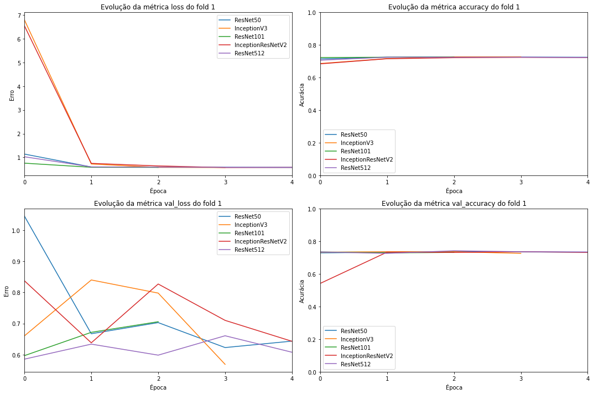
    


    
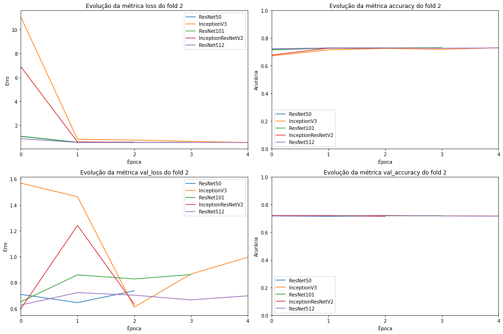
    


    
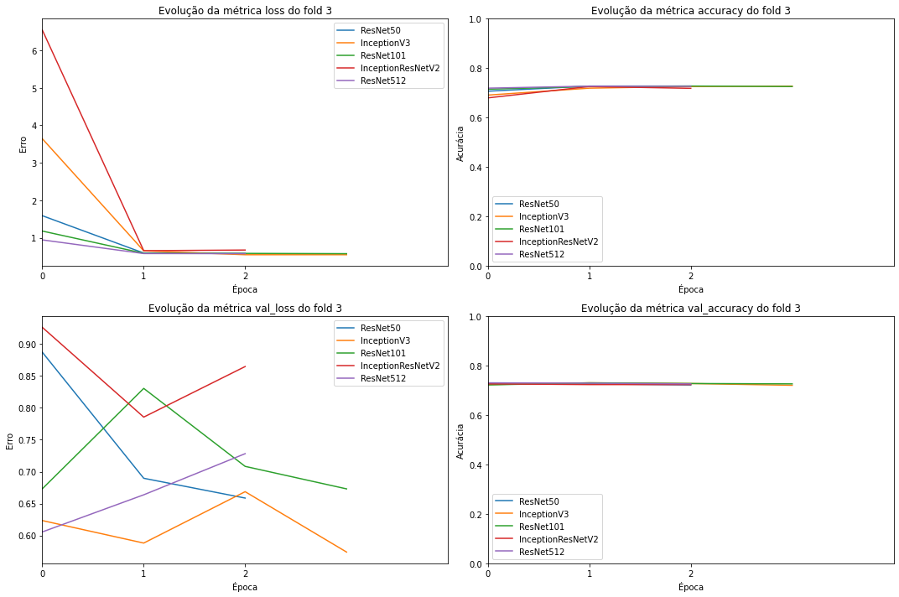
    


    
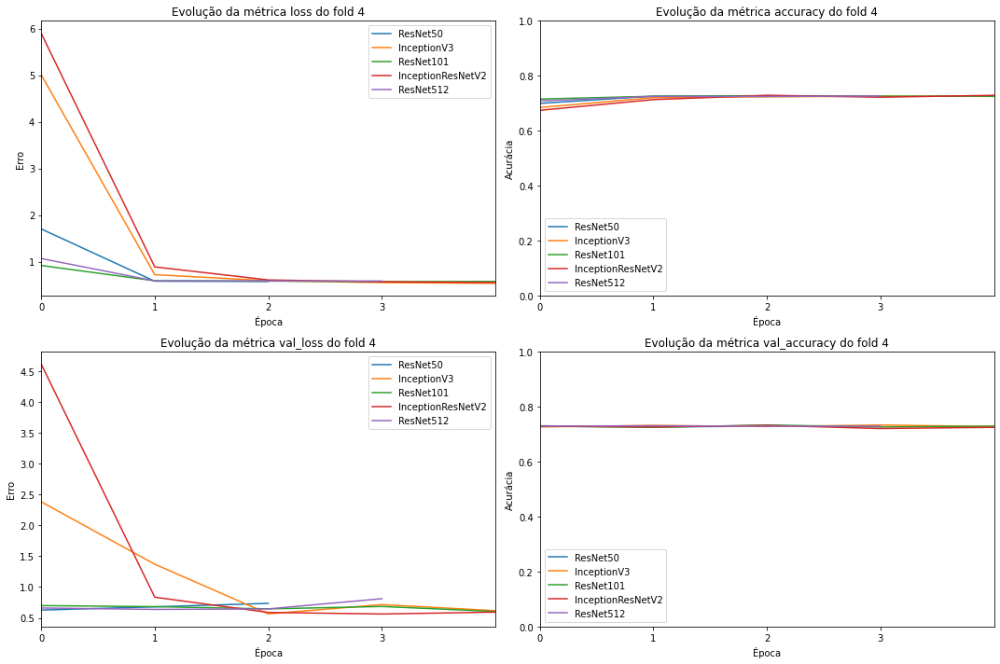
    


    
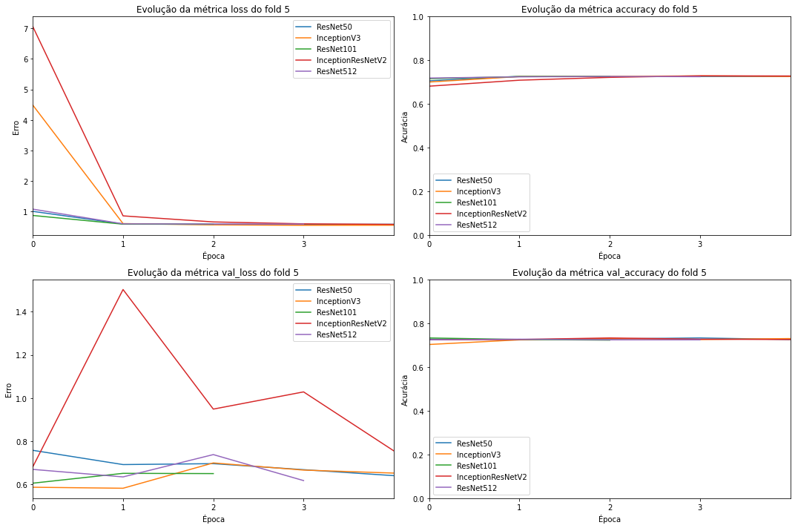
    


    
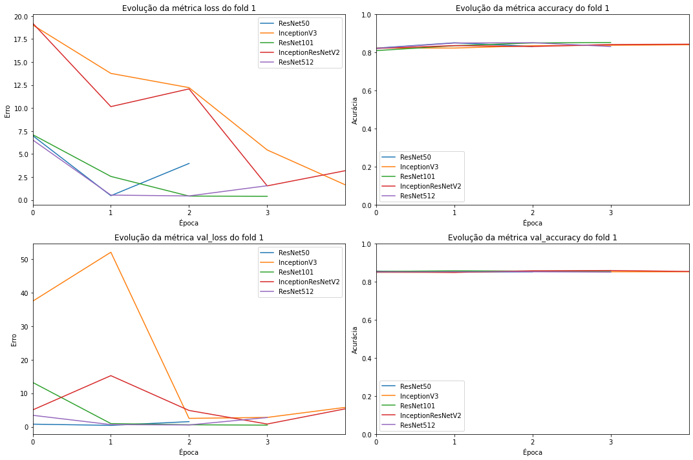
    


    
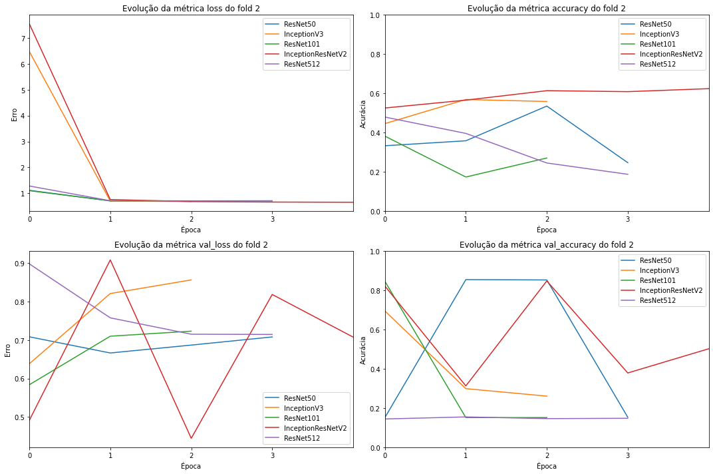
    


    
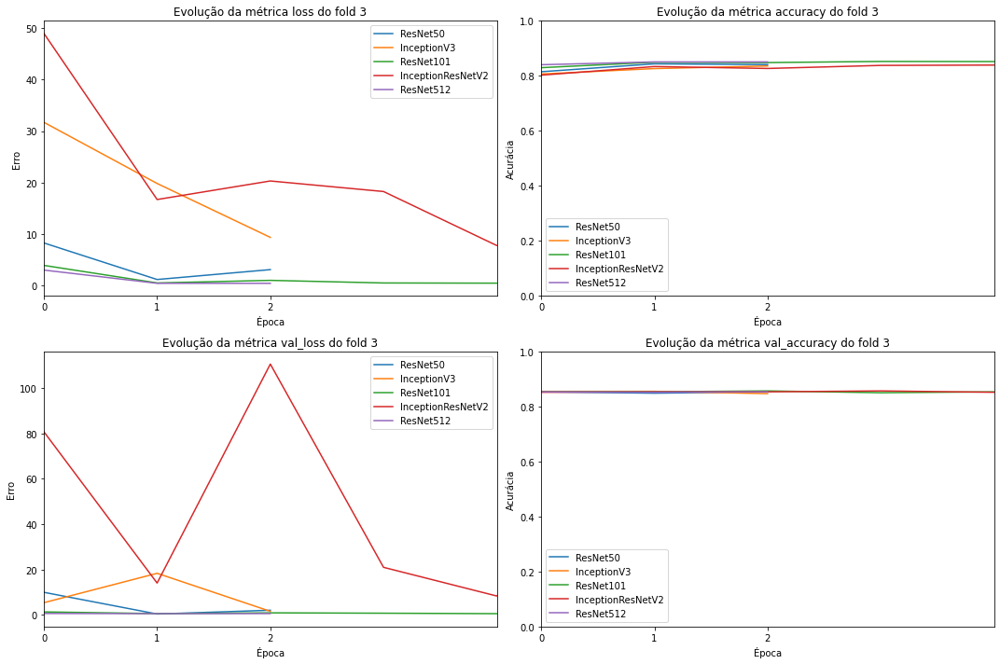
    


    
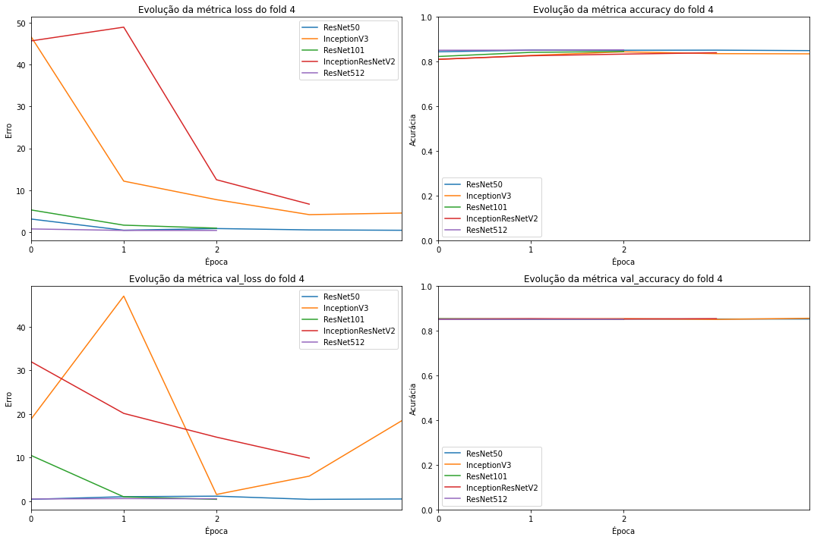
    


    
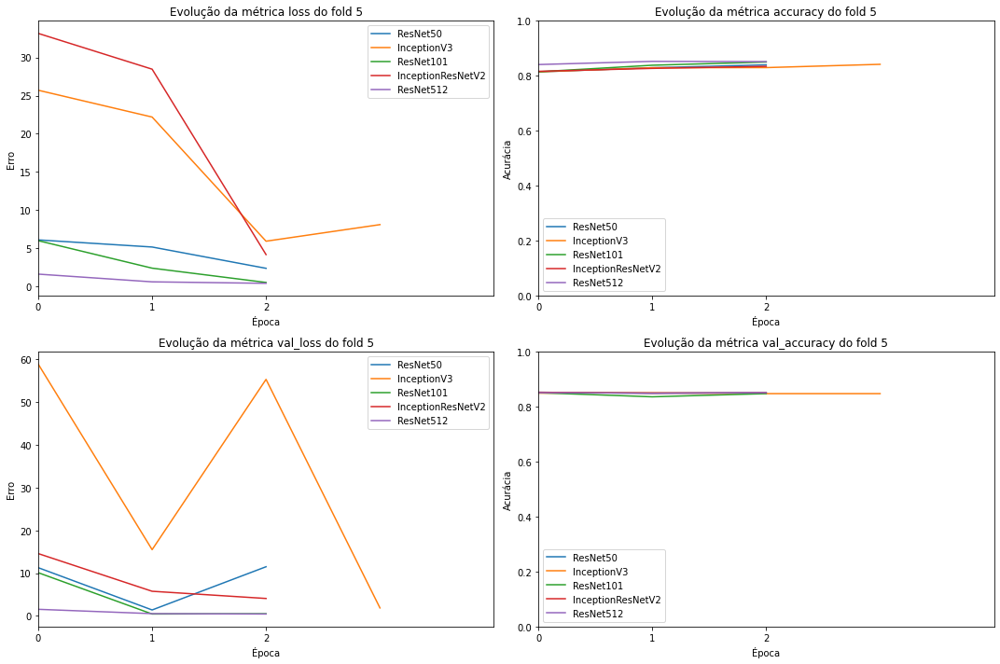
    


## Resultados

Cria a tabela com os resultados obtidos, indexada pelo modelo pré-treinado utilizado e o *fold*. As colunas são:
*   **TP**: Verdadeiros positivos
*   **TN**: Verdadeiros negativos
*   **FP**: Falsos positivos
*   **FN**: Falsos negativos
*   **ACC**: Acurácia. (TP + TN) / (TP + TN + FP + FN)
*   **SPE**: Especificidade. Cobertura da classe negativa. TN / (TN + FP)
*   **REC**: Cobertura. TP / (TP + FN)
*   **PRE**: Precisão. TP / (TP + FP)
*   **F1**: Pontuação F1. 2 * (PRE * REC) / (PRE + REC)


```python
def get_report(models, r):
    total_columns = ['TP', 'TN', 'FP', 'FN']
    average_columns = ['ACC', 'SPE', 'REC', 'PRE', 'F1']
    
    data = {}
    
    for model in models:
        for f in range(K_FOLDS):
            data[(model, f'Fold-{f + 1}')] = r[model]['fold_metrics'][f]
        data[(model, 'Total/average')] = {}
        for m in total_columns:
            data[(model, 'Total/average')][m] = sum([r[model]['fold_metrics'][f][m] for f in range(K_FOLDS)])
        for m in average_columns:
            data[(model, 'Total/average')][m] = numpy.average([r[model]['fold_metrics'][f][m] for f in range(K_FOLDS)])
    return DataFrame.from_dict(data).swapaxes(0, 1)
```


```python
reports = [get_report(BASE_MODELS, result) for result in results]
```


```python
for i, report in enumerate(reports):
    print(f'Dataset {i + 1}')
    print(report)
```

    Dataset 1
                                       TP     TN    FP      FN       ACC  \
    ResNet50          Fold-1          0.0  201.0   0.0   511.0  0.717697   
                      Fold-2          0.0  201.0   0.0   532.0  0.725784   
                      Fold-3          0.0  195.0   0.0   525.0  0.729167   
                      Fold-4          0.0  197.0   0.0   526.0  0.727524   
                      Fold-5          0.0  194.0   0.0   530.0  0.732044   
                      Total/average   0.0  988.0   0.0  2624.0  0.726443   
    InceptionV3       Fold-1         11.0  190.0  33.0   478.0  0.686798   
                      Fold-2          0.0  201.0   0.0   532.0  0.725784   
                      Fold-3          0.0  195.0   0.0   525.0  0.729167   
                      Fold-4          0.0  197.0   0.0   526.0  0.727524   
                      Fold-5          0.0  194.0   0.0   530.0  0.732044   
                      Total/average  11.0  977.0  33.0  2591.0  0.720263   
    ResNet101         Fold-1          0.0  201.0   0.0   511.0  0.717697   
                      Fold-2          0.0  201.0   0.0   532.0  0.725784   
                      Fold-3          0.0  195.0   0.0   525.0  0.729167   
                      Fold-4          0.0  197.0   0.0   526.0  0.727524   
                      Fold-5          0.0  194.0   0.0   530.0  0.732044   
                      Total/average   0.0  988.0   0.0  2624.0  0.726443   
    InceptionResNetV2 Fold-1          2.0  199.0   3.0   508.0  0.716292   
                      Fold-2          1.0  200.0   0.0   532.0  0.727149   
                      Fold-3          0.0  195.0   4.0   521.0  0.723611   
                      Fold-4          0.0  197.0   0.0   526.0  0.727524   
                      Fold-5          0.0  194.0   0.0   530.0  0.732044   
                      Total/average   3.0  985.0   7.0  2617.0  0.725324   
    ResNet512         Fold-1          0.0  201.0   0.0   511.0  0.717697   
                      Fold-2          0.0  201.0   0.0   532.0  0.725784   
                      Fold-3          0.0  195.0   0.0   525.0  0.729167   
                      Fold-4          0.0  197.0   0.0   526.0  0.727524   
                      Fold-5          0.0  194.0   0.0   530.0  0.732044   
                      Total/average   0.0  988.0   0.0  2624.0  0.726443   
    
                                          SPE       REC       PRE        F1  
    ResNet50          Fold-1         0.000000  1.000000  0.717697  0.835650  
                      Fold-2         0.000000  1.000000  0.725784  0.841107  
                      Fold-3         0.000000  1.000000  0.729167  0.843373  
                      Fold-4         0.000000  1.000000  0.727524  0.842274  
                      Fold-5         0.000000  1.000000  0.732044  0.845295  
                      Total/average  0.000000  1.000000  0.726443  0.841540  
    InceptionV3       Fold-1         0.054726  0.935421  0.715569  0.810857  
                      Fold-2         0.000000  1.000000  0.725784  0.841107  
                      Fold-3         0.000000  1.000000  0.729167  0.843373  
                      Fold-4         0.000000  1.000000  0.727524  0.842274  
                      Fold-5         0.000000  1.000000  0.732044  0.845295  
                      Total/average  0.010945  0.987084  0.726018  0.836581  
    ResNet101         Fold-1         0.000000  1.000000  0.717697  0.835650  
                      Fold-2         0.000000  1.000000  0.725784  0.841107  
                      Fold-3         0.000000  1.000000  0.729167  0.843373  
                      Fold-4         0.000000  1.000000  0.727524  0.842274  
                      Fold-5         0.000000  1.000000  0.732044  0.845295  
                      Total/average  0.000000  1.000000  0.726443  0.841540  
    InceptionResNetV2 Fold-1         0.009950  0.994129  0.718529  0.834154  
                      Fold-2         0.004975  1.000000  0.726776  0.841772  
                      Fold-3         0.000000  0.992381  0.727654  0.839645  
                      Fold-4         0.000000  1.000000  0.727524  0.842274  
                      Fold-5         0.000000  1.000000  0.732044  0.845295  
                      Total/average  0.002985  0.997302  0.726505  0.840628  
    ResNet512         Fold-1         0.000000  1.000000  0.717697  0.835650  
                      Fold-2         0.000000  1.000000  0.725784  0.841107  
                      Fold-3         0.000000  1.000000  0.729167  0.843373  
                      Fold-4         0.000000  1.000000  0.727524  0.842274  
                      Fold-5         0.000000  1.000000  0.732044  0.845295  
                      Total/average  0.000000  1.000000  0.726443  0.841540  
    Dataset 2
                                       TP     TN     FP      FN       ACC  \
    ResNet50          Fold-1          0.0   91.0    0.0   511.0  0.848837   
                      Fold-2          0.0   91.0    0.0   532.0  0.853933   
                      Fold-3          0.0   91.0    0.0   525.0  0.852273   
                      Fold-4          0.0   93.0    0.0   526.0  0.849758   
                      Fold-5          0.0   92.0    0.0   530.0  0.852090   
                      Total/average   0.0  458.0    0.0  2624.0  0.851378   
    InceptionV3       Fold-1         24.0   67.0  148.0   363.0  0.642857   
                      Fold-2          0.0   91.0    0.0   532.0  0.853933   
                      Fold-3          0.0   91.0    0.0   525.0  0.852273   
                      Fold-4          0.0   93.0    0.0   526.0  0.849758   
                      Fold-5          0.0   92.0    0.0   530.0  0.852090   
                      Total/average  24.0  434.0  148.0  2476.0  0.810182   
    ResNet101         Fold-1          0.0   91.0    0.0   511.0  0.848837   
                      Fold-2          0.0   91.0    0.0   532.0  0.853933   
                      Fold-3          0.0   91.0    0.0   525.0  0.852273   
                      Fold-4          0.0   93.0    0.0   526.0  0.849758   
                      Fold-5          0.0   92.0    0.0   530.0  0.852090   
                      Total/average   0.0  458.0    0.0  2624.0  0.851378   
    InceptionResNetV2 Fold-1          1.0   90.0   15.0   496.0  0.825581   
                      Fold-2          0.0   91.0    0.0   532.0  0.853933   
                      Fold-3          0.0   91.0    0.0   525.0  0.852273   
                      Fold-4          0.0   93.0    0.0   526.0  0.849758   
                      Fold-5          0.0   92.0    1.0   529.0  0.850482   
                      Total/average   1.0  457.0   16.0  2608.0  0.846405   
    ResNet512         Fold-1         91.0    0.0  511.0     0.0  0.151163   
                      Fold-2          0.0   91.0    0.0   532.0  0.853933   
                      Fold-3          0.0   91.0    0.0   525.0  0.852273   
                      Fold-4          0.0   93.0    0.0   526.0  0.849758   
                      Fold-5          0.0   92.0    0.0   530.0  0.852090   
                      Total/average  91.0  367.0  511.0  2113.0  0.711843   
    
                                          SPE       REC       PRE        F1  
    ResNet50          Fold-1         0.000000  1.000000  0.848837  0.918239  
                      Fold-2         0.000000  1.000000  0.853933  0.921212  
                      Fold-3         0.000000  1.000000  0.852273  0.920245  
                      Fold-4         0.000000  1.000000  0.849758  0.918777  
                      Fold-5         0.000000  1.000000  0.852090  0.920139  
                      Total/average  0.000000  1.000000  0.851378  0.919723  
    InceptionV3       Fold-1         0.263736  0.710372  0.844186  0.771520  
                      Fold-2         0.000000  1.000000  0.853933  0.921212  
                      Fold-3         0.000000  1.000000  0.852273  0.920245  
                      Fold-4         0.000000  1.000000  0.849758  0.918777  
                      Fold-5         0.000000  1.000000  0.852090  0.920139  
                      Total/average  0.052747  0.942074  0.850448  0.890379  
    ResNet101         Fold-1         0.000000  1.000000  0.848837  0.918239  
                      Fold-2         0.000000  1.000000  0.853933  0.921212  
                      Fold-3         0.000000  1.000000  0.852273  0.920245  
                      Fold-4         0.000000  1.000000  0.849758  0.918777  
                      Fold-5         0.000000  1.000000  0.852090  0.920139  
                      Total/average  0.000000  1.000000  0.851378  0.919723  
    InceptionResNetV2 Fold-1         0.010989  0.970646  0.846416  0.904284  
                      Fold-2         0.000000  1.000000  0.853933  0.921212  
                      Fold-3         0.000000  1.000000  0.852273  0.920245  
                      Fold-4         0.000000  1.000000  0.849758  0.918777  
                      Fold-5         0.000000  0.998113  0.851852  0.919201  
                      Total/average  0.002198  0.993752  0.850846  0.916744  
    ResNet512         Fold-1         1.000000  0.000000  0.000000  0.000000  
                      Fold-2         0.000000  1.000000  0.853933  0.921212  
                      Fold-3         0.000000  1.000000  0.852273  0.920245  
                      Fold-4         0.000000  1.000000  0.849758  0.918777  
                      Fold-5         0.000000  1.000000  0.852090  0.920139  
                      Total/average  0.200000  0.800000  0.681611  0.736075  


```python
def plot_confusion_matrix(results_list, base_model_name, fold, dataset):
    m = results_list[base_model_name]['fold_confusion_matrix'][fold]
    names = sorted(dataset[LABEL_COL_NAME].unique())
    
    pyplot.ylabel('Classificação verdadeira')
    pyplot.xlabel('Classificação prevista')
    pyplot.xticks(numpy.arange(len(names)), names, rotation=90)
    pyplot.yticks(numpy.arange(len(names)), names)
    pyplot.imshow(100 * m.astype('float') / m.sum(axis=1)[:, numpy.newaxis])
    pyplot.colorbar(format=ticker.PercentFormatter())
```


```python
plot_confusion_matrix(results[1], 'InceptionV3', 1, dataset1)
```


    
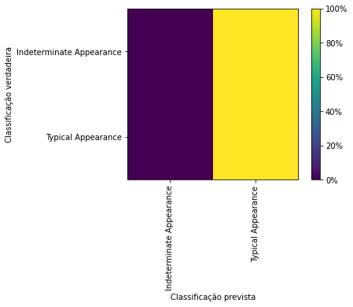
    


# Referências

* **NARIN, Ali; KAYA, Ceren; PAMUK, Ziynet. Automatic detection of coronavirus disease (COVID-19) using X-ray images and deep convolutional neural networks.** Pattern Analysis And Applications, [S.L.], v. 24, n. 3, p. 1207-1220, 9 maio 2021. Springer Science and Business Media LLC.
*   **How to implement K-Fold Cross validation using Image data generator and using Flow from dataframe (using CSV file)**. Disponível em https://stackoverflow.com/questions/64684789/how-to-implement-k-fold-cross-validation-using-image-data-generator-and-using-fl. Acessado em 15 de setembro de 2021.
*   **Selecting multiple columns in a Pandas dataframe**. Disponível em: https://stackoverflow.com/questions/11285613/selecting-multiple-columns-in-a-pandas-dataframe. Acessado em 16 de setembro de 2021
*   **How to install pydicom**. Disponível em: https://pydicom.github.io/pydicom/stable/tutorials/installation.html. Acessado em 16 de setembro de 2021.
*   **MultiIndex / advanced indexing**. Disponível em: https://pandas.pydata.org/pandas-docs/stable/user_guide/advanced.html. Acessado em 17 de setembro de 2021.
